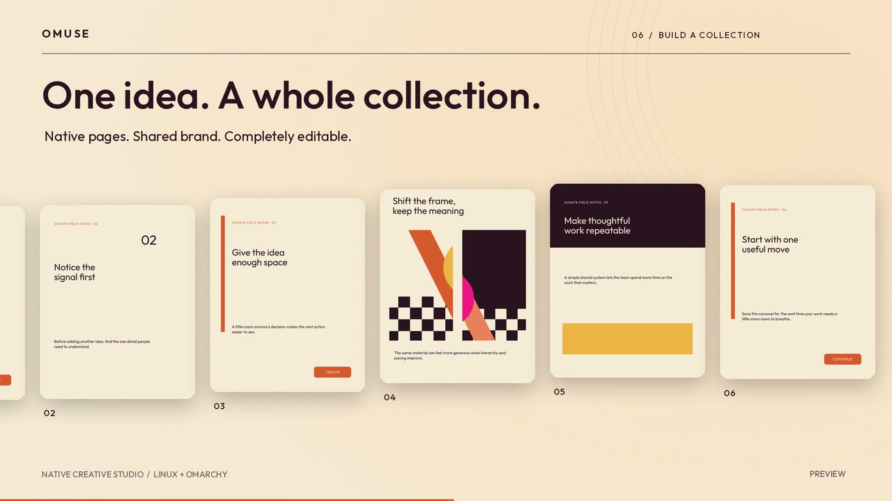
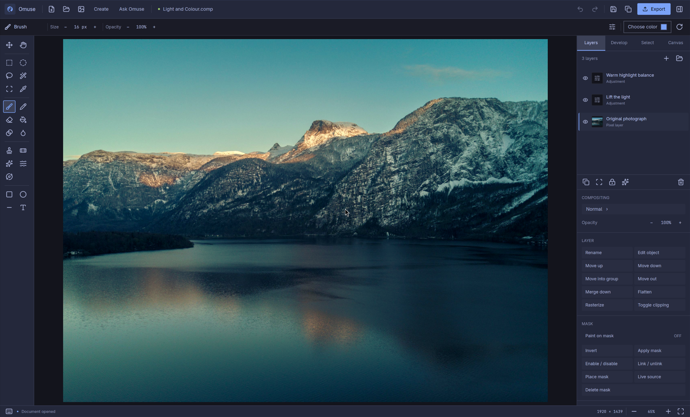

# Omuse

### A native creative studio for Linux.

<p align="center">
  
</p>

[](https://github.com/Sugata-Software/Omuse/actions/workflows/rust-validation.yml)

**Omuse is available to install on Omarchy and Arch Linux.** The one-command
installer builds a tested source revision and adds the normal **Omuse** app.
Downloadable binaries are still undergoing [release qualification](docs/public-release-readiness.md).

**Current release: [0.5.0](https://github.com/Sugata-Software/Omuse/releases/tag/v0.5.0)**
— one `.omuse` extension for every project, safe legacy migration and clearer saves. Read the [release notes](docs/releases/v0.5.0.md)
or browse the [changelog](CHANGELOG.md) for changes and known limitations.

**[Read the user manual](docs/user-guide/README.md)** ·
[Remove unwanted objects](docs/user-guide/remove-objects.md) ·
[Edit a photo](docs/user-guide/photo-editing.md) ·
[Create social content](docs/user-guide/create-content.md)

<p align="center">
  <a href="docs/media/omuse-sunset-muse.mp4">
    
  </a>
</p>

<p align="center">
  <a href="docs/media/omuse-sunset-muse.mp4"><strong>&#9654; Watch the two-minute Sunset Muse promo</strong></a>
  &middot;
  <a href="docs/media/omuse-sunset-muse-credits.md">Media credits</a>
</p>

The film presents selected Omuse workflows. Current qualification evidence
and remaining release gates are recorded in the release-readiness checklist.

Omuse is a native image editor for Linux, built in Rust with GPUI and designed
to feel at home on Omarchy. It combines a compact studio interface with layered
editing, painting, selections, live adjustments, editable text and shapes,
Camera RAW support, colour-managed export, and advanced non-destructive
workflows. The Create workspace adds editable branded pages, templates,
carousels, content packs and motion, with an optional in-app AI assistant.

The application follows the current Omarchy theme through
[`gpui-omarchy`](https://github.com/huacnlee/gpui-omarchy), while keeping artwork
colours and the transparency checkerboard independent of desktop styling.
Editing and local subject selection run on your machine. Optional AI requests
send the selected context to the connection you choose; the assistant identifies
the subscription route and its usage. Separate API billing is currently disabled.
Omuse does not change the desktop theme.



*Actual Omuse session on Omarchy. [Image credit](docs/media/README.md).*

## Install

On **Omarchy or Arch Linux (x86_64)**, open a terminal and run:

```sh
curl -fsSL https://raw.githubusercontent.com/Sugata-Software/Omuse/main/install.sh | bash
```

Then open **Omuse** from your application launcher.

The installer sets up dependencies, builds Omuse, verifies the editor and
installs it for your user. Camera RAW and local subject-selection assets are
included. It asks for your password only if system packages need installing.
Run the command as your normal desktop user; do not prefix it with `sudo`.
The installer pins the [tested application revision](docs/install.md#tested-source-channel);
application changes on `main` are built only after that pin advances. The installer
script itself is downloaded from `main`.

**The current installer builds from source.** Allow time for the first build
and about 12 GB of free disk space. Later installs reuse the build cache.
Prebuilt downloads will follow release qualification. You can
[inspect the installer](install.sh) before running it.

| Task | Command |
| --- | --- |
| Update | Run the same install command again |
| Launch in a terminal | `~/.local/bin/omuse` |
| Roll back an update | `~/.local/bin/omuse-manage rollback` |
| Uninstall | `~/.local/bin/omuse-manage uninstall` |

Updates keep the previous executable **and its runtime assets** together.
Uninstall keeps your projects, settings and recovery files. The installer does
not change your Omarchy theme or shell configuration. See the
[installation guide](docs/install.md) for custom locations, cached downloads
and troubleshooting.

## Highlights

- Layers, groups, masks, clipping, blend modes, live adjustments and effects.
- Interactive crop ratios, anchored zoom and editable layer/group Copy/Paste.
- Brush, Pencil, Eraser, Fill, Gradient, Clone, Heal and selection tools.
- Editable text and shapes, Bézier paths, vector masks and transform workflows.
- Editable `.omuse` projects for single canvases and multi-page collections.
- Brand kits, 20 editable templates with 80 tested size variants, rich text, reusable components, image
  frames, CSV variants and a searchable local asset library.
- Social previews, ordered raster/PDF content packs, captions and image descriptions.
- Layer and page animation, MP4/GIF export, audio, editable subtitles and clip tools.
- [Ask Omuse](docs/ai-experience.md): task-based subscription AI for editable designs,
  reversible photo adjustments, captions and image drafts, with Before/After
  review and Undo; provider availability is qualified separately.
- Choose Auto or a provider per task; optionally follow an image edit with
  editable layout and a caption in one reviewed workflow.
- PNG, JPEG, WebP and TIFF export, including retained 16-bit workflows.
- Layered PSD import, Camera RAW development and local subject selection within
  their documented limits.
- Omarchy-aware controls, colours, theme watching and native Linux file dialogs.
- Refined editing, Create and AI panels with grouped controls and compact layouts.
- Searchable, executable commands and customizable Photoshop-inspired shortcuts.

Explore the [editing workflows](docs/rust-advanced-workflows.md),
[Create guide](docs/omuse-create-guide.md) and
[categorized project guide](docs/project-guide.md). The
[release checklist](docs/public-release-readiness.md) distinguishes tested
features from the remaining public-release work. Omuse focuses on creating
content; calendars and scheduling are outside its scope.

## Work from the keyboard

Press **Ctrl+K** or click the search icon to find and run any of **171 commands**.
Search by action, tool, category or key combination; use **↑ / ↓** and **Enter**
to run, or **Esc** to return to your canvas. Commands without a shortcut are
available here too.

There are **101 default shortcuts**, including familiar tools, **Ctrl+L** for
Levels, **Ctrl+M** for Curves, **Ctrl+U** for Hue/Saturation, and **[ / ]** for
brush size. **Ctrl+Alt+K** opens the recorder for customizing, clearing and
restoring bindings. Super stays available to Omarchy.

See the [complete keyboard and gesture reference](docs/keyboard-shortcuts.md)
for all commands, text-editing behaviour and changes from earlier defaults.

## Build and contribute

For developers:

```sh
git clone https://github.com/Sugata-Software/Omuse.git
cd Omuse
scripts/build-rust.sh
rust/target/release/omuse
```

The [Linux development guide](rust/README.md) covers build prerequisites,
tests and the source map. Start with [CONTRIBUTING.md](CONTRIBUTING.md) for a
fix or contribution. Omuse uses Rust and native Linux libraries.

## Projects and user data

Use **`.omuse`** for every editable project, from a single canvas to a multi-page
Create collection. Projects are directory packages: keep the entire directory
when copying or backing up artwork. Omuse identifies a canvas by its
`manifest.json` and a collection by its `project.json`, preserving editable
layers, native objects and the collection's pages, brands and packaged assets.

Existing `.comp` projects still open. Their first **Save** offers an `.omuse`
copy and leaves the original intact. Opening a project does not rename or
rewrite it; recovery snapshots stay separate from saved artwork.

New collection saves use schema version 2 with nested `.omuse` pages and
components. Version 1 collections still open, but saving upgrades them to
version 2, which earlier Omuse releases cannot read. Use **Save As** to a new
location if you need to retain a version 1 copy for an earlier release. The
[compatibility contract](docs/omuse-rename.md) explains the preserved layer
format and migration behavior.

New settings and application data use the XDG locations
`$XDG_CONFIG_HOME/omuse` and `$XDG_DATA_HOME/omuse` (normally
`~/.config/omuse` and `~/.local/share/omuse`). The rename keeps compatibility
with earlier settings, shortcuts, brushes and recovery data. See the
[rename compatibility contract](docs/omuse-rename.md) for the migration rules.

## Test and release evidence

Run the local Rust checks with:

```sh
scripts/test-rust.sh
```

The complete test journey includes MP4/GIF export and requires FFmpeg.

Automated headless checks do not replace native display, portal,
mixed-DPI or optional-backend qualification. The required evidence is listed in
[Rust release gates](docs/rust-release-gates.md) and
[save/recovery qualification](docs/rust-release-qualification.md).
The maintained [OmaPhoto comparison](docs/omaphoto-comparison.md) connects
upstream releases to implemented improvements and remaining qualification work.

## History and attribution

Omuse is developed by [Sugata Software](https://github.com/Sugata-Software).
Contributions and carefully scoped bug reports are welcome; start with
[CONTRIBUTING.md](CONTRIBUTING.md). Use copies of important artwork while
evaluating Omuse.

Omuse grew from [Robbie Tilton's Compositor](https://github.com/robbietilton/Compositor)
and [its earlier Linux fork](https://github.com/chiddekel/Compositor). We retain
their original copyright notices and credit their contribution to the project
format and editing foundations. Omuse is now developed as a native Linux
application with its own interface, workflows and release path.

See [acknowledgements and source provenance](docs/source-provenance.md) for
upstream credits and the archived implementations.

## License

Application source: MIT — see [LICENSE](LICENSE), including the retained
original copyright notice. Third-party code, fonts, images and optional runtime
assets retain their own licences. Runtime notices are under `rust/licenses/`;
the [dependency notice review](docs/rust-license-findings.md) records unresolved
binary-distribution findings. The source licence does not relicense third-party
media.
