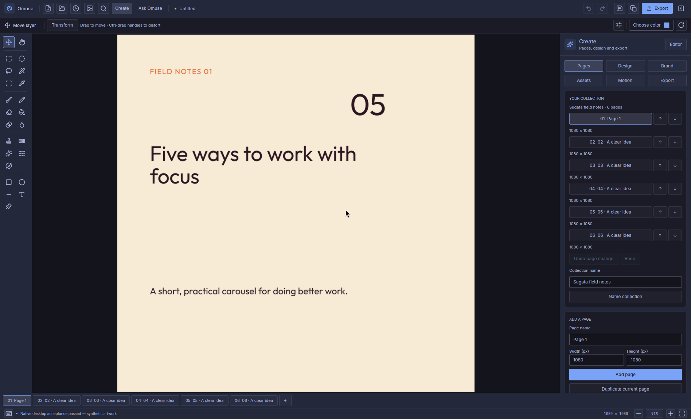

# Omuse

### A native creative studio for photos, vectors and content.

<p align="center">
  
</p>

[](https://github.com/Sugata-Software/Omuse/actions/workflows/rust-validation.yml)

**Built for Omarchy and Arch Linux, with an experimental Windows build.**
The Linux installer builds the tested source release and adds **Omuse** to your
application launcher. Windows x64 users can download a portable development ZIP.

**[Install on Linux](#linux)** · **[Download for Windows](#windows-experimental)**

**Current source pre-release: [0.8.0 — Colour, curves and control](https://github.com/Sugata-Software/Omuse/releases/tag/v0.8.0)**
— reference colour matching, softer masks, richer vector artwork, editable text
on curves and clearer JPEG inspection. Read the [release notes](docs/releases/v0.8.0.md)
or browse the [interface gallery](docs/releases/v0.8.0-gallery.md).

[Explore what’s new](#new-in-080) ·
[Follow the photo and vector workflows](docs/user-guide/photo-vector.md#photo-and-vector-tools-in-080).
Linux and Windows archives are qualified as **unsigned experimental previews**;
source and binary publication are separate steps, as described below.

**[Read the user manual](docs/user-guide/README.md)** ·
[Edit a photo](docs/user-guide/photo-editing.md) ·
[Draw and trace vectors](docs/user-guide/photo-vector.md) ·
[Create social content](docs/user-guide/create-content.md)

<p align="center">
  <a href="https://github.com/Sugata-Software/Omuse/raw/refs/heads/main/docs/media/omuse-0.7.0-studio-film.mp4">
    
  </a>
</p>

<p align="center">
  <a href="https://github.com/Sugata-Software/Omuse/raw/refs/heads/main/docs/media/omuse-0.7.0-studio-film.mp4"><strong>&#9654; Watch the new two-minute Omuse 0.7.0 film</strong></a>
  &middot;
  <a href="docs/media/omuse-0.7.0-studio-film.md">Chapters, transcript &amp; credits</a>
</p>

Four real photo before/after edits, the 0.7.0 vector and tracing controls,
branded pages, native motion and content exports. The film combines actual
application captures and Omuse-rendered artwork with editorial animation.
Its AI segment is an offline interface tour.

Omuse is a native image editor built in Rust with GPUI and designed
to feel at home on Omarchy. It combines a compact studio interface with layered
editing, painting, selections, live adjustments, editable text and shapes,
Camera RAW support, colour-managed export, and advanced non-destructive
workflows. The Create workspace adds editable branded pages, templates,
carousels, content packs and motion, with an optional in-app AI assistant.

On Omarchy, the application follows the current desktop theme through
[`gpui-omarchy`](https://github.com/huacnlee/gpui-omarchy), while keeping artwork
colours and the transparency checkerboard independent of desktop styling.
The Windows development build follows the system light or dark app setting.
Editing and local subject selection run on your machine. Optional AI requests
send the selected context to the connection you choose; the assistant identifies
the subscription route and its usage. Separate API billing is currently disabled.
Omuse does not change the desktop theme.


*The native 0.7.0 editor on Omarchy, with editable photo adjustments.
[Photo workflow](docs/user-guide/photo-editing.md) · [Image credit](docs/media/README.md).*

## Install

### Linux

On **Omarchy or Arch Linux (x86_64)**, open a terminal and run:

```sh
curl -fsSL https://raw.githubusercontent.com/Sugata-Software/Omuse/main/install.sh | bash
```

Then open **Omuse** from your application launcher.

The installer sets up dependencies, builds Omuse, verifies the editor and
installs it for your user. Camera RAW and local subject-selection assets are
included. It asks for your password only if system packages need installing.
Run the command as your normal desktop user; do not prefix it with `sudo`.
The installer pins the [tested application revision](docs/install.md#tested-source-channel);
application changes on `main` are built only after that pin advances. The installer
script itself is downloaded from `main`.

**The current installer builds from source.** Allow time for the first build
and about 12 GB of free disk space. Later installs reuse the build cache.
Reviewed unsigned Linux archives are listed on the
[release page](https://github.com/Sugata-Software/Omuse/releases/tag/v0.8.0) when
binary publication completes. The curl command remains the source installer.
You can [inspect it](install.sh) before running it.

| Task | Command |
| --- | --- |
| Update | Run the same install command again |
| Launch in a terminal | `~/.local/bin/omuse` |
| Roll back an update | `~/.local/bin/omuse-manage rollback` |
| Uninstall | `~/.local/bin/omuse-manage uninstall` |

Updates keep the previous executable **and its runtime assets** together.
Uninstall keeps your projects, settings and recovery files. The installer does
not change your Omarchy theme or shell configuration. See the
[installation guide](docs/install.md) for custom locations, cached downloads
and troubleshooting.

### Windows (experimental)

**[Open the 0.8.0 release page](https://github.com/Sugata-Software/Omuse/releases/tag/v0.8.0)** ·
[Reviewed build artifacts](https://github.com/Sugata-Software/Omuse/actions/runs/37161936378)

The portable **Windows x64** preview needs neither Rust nor Visual Studio.
The 0.8.0 package passed automated checks on Windows Server 2025; interactive
Windows 10/11 qualification is still separate.

1. When application assets appear on the release page, download
   **omuse-0.8.0-windows-x86_64.zip**. GitHub’s automatic source archives are not
   application downloads.
2. Extract the complete ZIP into a new folder.
3. Run **omuse.exe**, keeping **lib**, **models** and **licenses** alongside it.

If binary publication is still pending, sign into GitHub and use the reviewed
build link above. Under **Artifacts**, download
**omuse-download-windows-x86_64-attempt-1**, then extract its inner
**omuse-0.8.0-windows-x86_64.zip**. These build artifacts are retained for
**30 days**; published release assets do not have that artifact expiry.
To update, keep the old complete folder, close the old app and launch the new
folder’s executable. The [reviewed manifest](docs/releases/downloads/v0.8.0.json)
records the source, native checks and archive hashes.

Photo editing and Camera RAW are included. These features have extra requirements:

| Feature | Setup |
| --- | --- |
| Local subject selection | Install Microsoft's [Visual C++ Redistributable (x64)](https://aka.ms/vs/17/release/vc_redist.x64.exe) |
| MP4 / GIF export | Install FFmpeg, for example `winget install Gyan.FFmpeg`, and make sure `ffmpeg.exe` and `ffprobe.exe` are on `PATH` |
| Ask Omuse | Install the official Codex CLI or the native Claude Code CLI, then open **Ask Omuse → Connections** to connect your account |

The Windows ZIP is **experimental and unsigned**, so SmartScreen may show a
warning. Live Windows AI generation/editing and clean-machine acceptance remain
unqualified; detecting a signed-in CLI does not establish that an AI task works.
The 0.8.0 package includes the reviewed dependency-notice fixes. See the
[Windows build notes](rust/README.md#build-on-windows-in-development) for
connection requirements and known limits.

## Highlights

### New in 0.8.0

These additions share the existing photo canvas and Layers inspector.
[Qualification and limits](docs/release-080-qualification.md) distinguish local
editing checks, automated Windows/package checks and remaining hardware work.

| Workflow | What 0.8.0 adds |
| --- | --- |
| **Build vector artwork on the photo canvas** | Select several objects, group them, align, distribute and transform them together. Unite, Subtract, Intersect, Exclude and Divide construct new filled shapes with Undo. [Arrange and combine](docs/user-guide/photo-vector.md#select-group-and-arrange). |
| **Refine fills and strokes** | Editable linear/radial gradients with 2–16 colour and transparency stops; cap, join, dash, gap and offset controls. Apply styles to selected objects in the Layers inspector. [Gradient and stroke guide](docs/user-guide/photo-vector.md#set-gradient-fills-and-precise-strokes). |
| **Put editable text on a curve** | Set content, font, size, tracking and alignment, then update the text from an edited guide. Keep the text recipe in `.omuse`, or convert glyphs to points for further editing. [Text on a curve](docs/user-guide/photo-vector.md#put-editable-text-on-a-curve). |
| **Exchange vector artwork** | Multiple supported SVG objects retain gradients and stroke settings. Export the active vector artwork as PDF, preserving supported paths, transparency and Pad gradients; text exports as glyph outlines. [SVG](docs/user-guide/photo-vector.md#exchange-an-svg-artwork) · [PDF](docs/user-guide/photo-vector.md#export-vector-artwork-as-pdf). |
| **Select colour with softer masks** | Sample a hue, control tolerance, softness and minimum saturation, then replace, add, subtract or intersect a selection, or create an editable layer mask. Feathered coverage stays soft. [Hue and mask guide](docs/user-guide/photo-vector.md#keep-soft-masks-and-select-by-hue). |
| **Borrow a reference palette** | Match reference colour adds a reversible Filter stack effect with Amount, Preserve lightness and optional selection masking. It supports ordinary photos and retained 16-bit sources. [Reference matching](docs/user-guide/photo-vector.md#match-the-palette-of-a-reference-image). |
| **Inspect the JPEG you will export** | Fit and 100% views show the actual encoded file. Pan through detail and compare quality, DPI and matte settings before saving. [JPEG preview](docs/user-guide/photo-vector.md#inspect-jpeg-detail-and-refine-raster-strokes). |
| **Retouch with more consistent strokes** | Blur, Smudge and Liquify use fractional brush footprints and consistent spacing. Smudge carries evolving paint; Liquify samples the original stroke source, with Undo and no partial commit when work limits are reached. [Raster retouch](docs/user-guide/photo-vector.md#inspect-jpeg-detail-and-refine-raster-strokes). |

Editable SVG remains a documented subset: text import, clipping, masks, effects,
group opacity and gradient strokes are not supported. Vector PDF exports the
active artwork, not the surrounding photo composition; it does not add PDF/AI
import or print-ready CMYK. Complete Create/page PDFs use the existing raster
export workflow. Reference matching transfers a global palette, rather than
recognizing subjects or reproducing an HDR look. The linked guides describe
format, font, image-size and editing limits.

### Studio essentials

- Layers, groups, masks, clipping, blend modes, live adjustments and effects.
- Interactive crop ratios including 3:4, anchored zoom and editable layer/group Copy/Paste.
- Brush, Pencil, Eraser, Fill, Gradient, Clone, Heal and selection tools.
- Editable text with live artwork previews and selected-letter colour styling;
  shapes, Bézier paths, vector masks and transform workflows.
- Integrated vector artwork on the main canvas with Pen, Nodes and Move tools,
  multi-object scenes, editable styles and native `.omuse` project storage.
- Local Image Trace for logos, illustrations and photo-art approximations, with
  Source/Trace preview, retained originals, editable curves and saved settings.
- Target colour uniformity and scale-aware 16-bit export sampling, with explicit
  limits documented in the photo/vector guide.
- Dither, halftone and ASCII, Bloom into transparency, Vignette overlay and
  spatial Local Contrast, with preview and Undo on 8-bit raster copies up to 16 MP.
- Brush, fill and gradient mask growth with preserved placement and outside coverage.
- Editable `.omuse` projects for single canvases and multi-page collections.
- Brand kits, 20 editable templates with 80 tested size variants, rich text, reusable components, image
  frames, CSV variants and a searchable local asset library.
- Social previews, ordered raster/PDF content packs, captions and image descriptions.
- Layer and page animation, MP4/GIF export, audio, editable subtitles and clip tools.
- [Ask Omuse](docs/ai-experience.md): task-based subscription AI for editable designs,
  reversible photo adjustments, captions and image drafts, with Before/After
  review and Undo; provider availability is qualified separately.
- Choose Auto or a provider per task; optionally follow an image edit with
  editable layout and a caption in one reviewed workflow.
- PNG, JPEG, WebP and TIFF export, including retained 16-bit workflows.
- Layered PSD/PSB import with supported editable text: 8-bit RGB only;
  embedded ICC profiles are refused. [Import limits](docs/user-guide/photo-editing.md#import-photoshop-or-svg-artwork).
- SVG/SVGZ raster import with selectable dimensions, up to 25 MP;
  self-contained artwork becomes one pixel layer, with the original preserved.
- Camera RAW development and local subject selection; Camera Raw sampling and
  targeted curve/mixer adjustments on 8-bit raster layers up to 16 MP.
- Omarchy-aware controls, colours, theme watching and native Linux file dialogs.
- Refined editing, Create and AI panels with grouped controls and compact layouts.
- Searchable recent projects, draggable numeric values and layer actions that
  explain missing prerequisites.
- Searchable, executable commands and customizable Photoshop-inspired shortcuts.

Explore the [editing workflows](docs/rust-advanced-workflows.md),
[Create guide](docs/omuse-create-guide.md) and
[categorized project guide](docs/project-guide.md). The
[release checklist](docs/public-release-readiness.md) distinguishes tested
features from the remaining public-release work. Omuse focuses on creating
content; calendars and scheduling are outside its scope.

## See the workflows

| Draw and refine on the canvas | Turn an image into editable shapes |
| --- | --- |
| [](docs/user-guide/photo-vector.md#draw-and-refine-an-editable-path) | [](docs/user-guide/photo-vector.md#turn-an-image-into-editable-vector-artwork) |
| **Pen, Nodes and Move** — shape curves, add points, style objects and keep the photo beneath them. | **Local Image Trace** — choose a preset, adjust detail, compare with the source and keep editable artwork. |

| Make a branded collection | Find a command from the keyboard |
| --- | --- |
| [](docs/user-guide/create-content.md) | [](docs/keyboard-shortcuts.md) |
| **Create** — templates, pages, reusable brand elements and ordered export packs. | **Ctrl+K** — search actions, tools and shortcuts, then run the result. |

Start with the [illustrated user manual](docs/user-guide/README.md), follow
[object removal](docs/user-guide/remove-objects.md), or open the
[complete ten-view gallery](docs/releases/v0.7.0-gallery.md).

## Work from the keyboard

In the **0.8.0 candidate**, press **Ctrl+K** or click the search icon to find and
run any of **200 commands**. Search by action, tool, category or key combination;
use **↑ / ↓** and **Enter**
to run, or **Esc** to return to your canvas. Commands without a shortcut are
available here too.

There are **106 default shortcuts**, including familiar tools, **Ctrl+L** for
Levels, **Ctrl+M** for Curves, **Ctrl+U** for Hue/Saturation, and **[ / ]** for
brush size. **Ctrl+Alt+K** opens the recorder for customizing, clearing and
restoring bindings. Super stays available to Omarchy.

See the [complete keyboard and gesture reference](docs/keyboard-shortcuts.md)
for all commands, text-editing behaviour and changes from earlier defaults.

## Build and contribute

For developers:

```sh
git clone https://github.com/Sugata-Software/Omuse.git
cd Omuse
scripts/build-rust.sh
rust/target/release/omuse
```

The [development guide](rust/README.md) covers Linux build prerequisites,
tests and the source map. Windows users can [download the portable build](#windows-experimental)
or compile it from source; see
[Build on Windows](rust/README.md#build-on-windows-in-development) for its
current limits. Start with [CONTRIBUTING.md](CONTRIBUTING.md) for a
fix or contribution. Omuse uses Rust with native platform integrations.

## Projects and user data

Use **`.omuse`** for every editable project, from a single canvas to a multi-page
Create collection. Projects are directory packages: keep the entire directory
when copying or backing up artwork. Omuse identifies a canvas by its
`manifest.json` and a collection by its `project.json`, preserving editable
layers, native objects and the collection's pages, brands and packaged assets.

Existing `.comp` projects still open. Their first **Save** offers an `.omuse`
copy and leaves the original intact. Opening a project does not rename or
rewrite it; recovery snapshots stay separate from saved artwork.

**Published Omuse 0.7.0 writes canvas format 11** for vector scenes and format 10
for ordinary canvases. Omuse 0.6.0 cannot read format-11 scenes or projects with
Target Colour Uniformity.

The **0.8.0 candidate** retains those formats for ordinary and flat legacy
artwork, and uses **format 12** for grouped scenes, **13** for gradients or
advanced strokes, and **14** for editable text on curves. **Older releases cannot
open these newer formats or the new reference-colour effect.** Use **Save As**
to retain an older copy; rolling back the app does not downgrade project files.

New collection saves use schema version 2 with nested `.omuse` pages and
components. Version 1 collections still open, but saving upgrades them to
version 2, which Omuse 0.4.0 and earlier cannot read. Use **Save As** to a new
location if you need to retain a version 1 copy for an earlier release. The
[compatibility contract](docs/omuse-rename.md) explains the preserved layer
format and migration behavior.

On Linux, settings and application data use the XDG locations
`$XDG_CONFIG_HOME/omuse` and `$XDG_DATA_HOME/omuse` (normally
`~/.config/omuse` and `~/.local/share/omuse`). On Windows, settings use
`%APPDATA%\omuse`; data and recovery use `%LOCALAPPDATA%\omuse`, unless XDG
locations are explicitly set. The rename keeps compatibility
with earlier settings, shortcuts, brushes and recovery data. See the
[rename compatibility contract](docs/omuse-rename.md) for the migration rules.

## Test and release evidence

Run the local Rust checks with:

```sh
scripts/test-rust.sh
```

The complete test journey includes MP4/GIF export and requires FFmpeg.

Automated headless checks do not replace native display, portal,
mixed-DPI or optional-backend qualification. The required evidence is listed in
[Rust release gates](docs/rust-release-gates.md) and
[save/recovery qualification](docs/rust-release-qualification.md).
The maintained [OmaPhoto comparison](docs/omaphoto-comparison.md) connects
upstream releases to implemented improvements and remaining qualification work.

## History and attribution

Omuse is developed by [Sugata Software](https://github.com/Sugata-Software).
Contributions and carefully scoped bug reports are welcome; start with
[CONTRIBUTING.md](CONTRIBUTING.md). Use copies of important artwork while
evaluating Omuse.

Omuse grew from [Robbie Tilton's Compositor](https://github.com/robbietilton/Compositor)
and [its earlier Linux fork](https://github.com/chiddekel/Compositor). We retain
their original copyright notices and credit their contribution to the project
format and editing foundations. Omuse has its own Rust/GPUI interface,
workflows and release path, with Linux as its reference platform and Windows
support in development.

See [acknowledgements and source provenance](docs/source-provenance.md) for
upstream credits and the archived implementations.

## License

Application source: MIT — see [LICENSE](LICENSE), including the retained
original copyright notice. Third-party code, fonts, images and optional runtime
assets retain their own licences. Runtime notices are under `rust/licenses/`.
The [dependency notice review](docs/rust-license-findings.md) records the
candidate's resolved missing-text findings, provenance and remaining platform
checks; this does not change older download receipts or qualify a public binary.
The source licence does not relicense third-party media.
