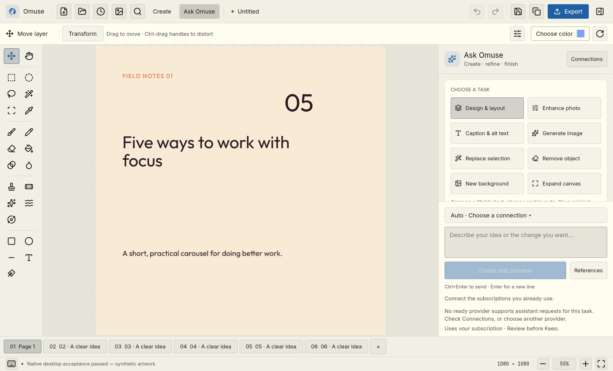

# Creating with Ask Omuse

Open **Ask Omuse** from the toolbar or command search. Choose a task, write a
brief or select a starting point, then customise it. A starting point never
sends a request. **Ctrl+Enter** and the primary button submit the same selected
task; Enter adds a new line.

For a complete removal walkthrough, see [Remove unwanted objects](user-guide/remove-objects.md).
For first projects, see the [user manual](user-guide/README.md).

*The 0.7.0 assistant sits beside your artwork. This screenshot uses an offline
demo profile; connect a supported provider before submitting a task.*

## Tasks

| Task | Result and controls |
| --- | --- |
| Design & layout | Editable text, shapes, layouts and content pages. Include or exclude a canvas preview. |
| Enhance photo | Exposure, brightness, contrast and saturation on the active ordinary pixel layer. Original pixels remain intact. |
| Caption & alt text | A caption and image description. Copy either directly or Keep both in the content project. |
| Generate image | A new image from a brief and optional references, reviewed before insertion. |
| Replace selection | New content within the selected area; pixels outside it stay protected. |
| Remove object | A natural fill for the selected area. |
| New background | A new background around the selected subject, with optional local finishing controls. |
| Expand canvas | Continue the scene into the pixel margins specified for each edge. |

Photo enhancement applies to the entire active layer. It does not interpret a
pixel selection as a local adjustment mask. It creates editable clipped
Exposure, Curves and Hue/Saturation layers. Exposure is bounded to ±3 stops;
brightness, contrast and saturation are bounded to ±100%. Locked, advanced,
already-clipped and non-pixel targets are rejected before submission. Camera
Raw-specific temperature, tint, highlight and shadow controls are not offered
through this operation.

## Connections and shared context

Connections lists official local subscription runtimes. Sign-in happens with
the provider. Omuse never copies a password or silently switches to a separately
billed API. Unsupported routes remain unavailable; first use of an untested
operation is explicitly labelled and can use subscription allowance.

Open **Ask Omuse → Connections**. When **ChatGPT via Codex** says **Signed in**,
an **Assistant · not tested** or **Images · not tested** label means that route
is ready for an explicit first request; it is not an error. You do not need a
separate login or test button in Omuse. To make an image, choose **Generate
image**, write the brief, select **Generate image**, review the proposal, then
select **Keep result** to add it to the canvas.

Each task can use **Auto** or a pinned provider. **Claude Code**
supports text-based **Design & layout**; **ChatGPT via Codex** supports the image
tasks, **Enhance photo** and **Caption & alt text**. Those visual tasks send
image context that the Claude adapter currently does not accept. Preferred
Assistant and Images roles guide Auto; task pins take precedence and never
silently fall back. The [provider guide](ai-provider-routing.md) also explains
optional image/edit → layout → caption sequences with one final review.

**Unverified** means Omuse found a runtime entry point but could not prove its
identity. **Sign in needed** means the runtime passed its identity checks but
its provider account is not available. Sign in with the official provider
runtime when needed, then use **Refresh** in Connections to check again.

The current release includes the fix for an earlier Omarchy discovery issue where recognized mise-managed
Codex or Claude shims could appear as **Unverified** despite an existing login.
Update through the normal installer if affected. Runtime identity and account
checks still apply, and unrecognized wrappers remain refused.

Codex can optionally report remaining allowance and reset windows through its
[official app-server protocol](https://learn.chatgpt.com/docs/app-server).
The display is a snapshot from the last connection check. Missing information
stays unavailable; Omuse does not infer an unlimited allowance or spend reset
credits. Refresh Connections updates the snapshot.

The request-context card names the content to be sent: a bounded canvas preview
when enabled/required, editable layer details, project/brand summaries and
chosen references. An image-edit request includes the canvas and its edit mask.
A refinement also includes its prior proposal and available result image.
Reference images are re-encoded before sending, rather than sharing their
original file metadata. **Local-only** in Connections prevents remote requests
for the collection.

Photo assessment and caption drafting require a visual assistant connection.
The current implementation supports canvas images through ChatGPT via Codex;
Claude's assistant path does not silently receive image references.

## Review, refine and recover

The canvas stays unchanged while the provider works. Stop cancels the current
request and unsent variations; a provider may already have consumed allowance.
Unknown outcomes are never retried automatically.

Review the listed changes and compare Before/After. **Keep result** applies the
candidate as one undo step. Photo responses cannot affect other layers or
perform layout operations; caption responses cannot edit artwork. Empty or
invalid results do not qualify the operation or expose an applicable result.

Refine this result and Another direction attach the saved proposal to the next
brief. They preserve its task and selected references, and do not submit by
themselves. Start a new request clears the current brief/context while keeping
saved history. Results from a changed or previous-session canvas remain
reviewable; they cannot blindly replace current artwork.

Completed results are retained within entry, file and metadata budgets. History
writes merge current on-disk entries under a lock and publish the index before
pruning old artifacts, so another window or a failed write cannot silently
erase alternatives. A window's list refreshes on history operations/reopen.

## Evidence boundaries

The [0.4.0 release record](release-040-qualification.md) covers the combined
connection, routing and panel runtime. The live requests below retain their
original candidate identities; they are not new 0.4.0 provider receipts.

The 0.2.0 runtime at public source
`3dc3e46310e40dcf109b1bc695bb4e9dda6d2d24` (tree
`1843e8e6242b210550365ad0aedf1e326cb06a38`) passed **843 application tests**:
365 library, 233 UI and 245 integration; four manual benchmarks were excluded.
Full GitHub Rust/installer validation passed. Production Wayland, XWayland and
the installed normal launcher each passed 24 native checks. Complete rollback
and normal desktop launch passed. See the
[qualification record](ai-experience-qualification.md) for exact evidence.

Three live requests used **Codex CLI 0.158.0**. Intermediate `df15fd4` passed
photo adjustment with Before/After and Keep/Undo, plus synthetic-scene caption
and alt text with Copy caption and Keep/Undo. Exact final `3dc3e46` reopened
that history, blocked applying an old result to the changed canvas, and refined
the photo for the new current layer. Readable review labels, Before/After,
Keep/Undo and Close from the focused prompt passed. The final source differs
from the first two requests only in readable layer-review labels and a test.

The 0.2.1 work additionally passed five live image journeys: Generate, Replace,
Remove, Background and Expand. Each used one explicit Codex subscription request,
with exact protected-pixel checks where relevant and Keep/save/reopen/Undo/Redo.
The [image-editing qualification](ai-image-editing-qualification.md) separates
that live runtime from the final local-finishing focus correction. See its
curated receipts and limits; synthetic examples do not certify photographic
quality on arbitrary content.

Current development evidence is narrower for Claude. Claude Code 2.1.283 with
an existing subscription login passed corrected discovery as **Ready /
SubscriptionAllowance**. The first Omuse synthetic assistant request exposed a
parser conflict with Claude Code's internal structured-output delivery. A
bounded direct CLI capture under the same flags then returned validated
structured output with only the internal `StructuredOutput` tool, no MCP
servers and no permission denials. The parser correction and six regressions
exist in source; all 14 Claude cases passed within a 387-test library run. The
rebuilt qualification client completed one synthetic structured request, and
the exact installed local candidate completed one welcome-card Design journey
with five editable operations, Review, Keep, toolbar Undo and Redo.

This is [bounded local Claude evidence](ai-claude-qualification.md), not a
release qualification. The demonstration was not saved or reopened; cancel,
refine and follow-up remain untested. Its review thumbnail may have distorted
the candidate's proportions even though the kept canvas was correct; the cause
is unproven and remains a visual check. The earlier signed-out receipt remains
historical. Grok remains unavailable and unqualified. Omuse copied no password
or API key, and separately billed API fallback remains disabled. Calendars and
scheduling remain outside this work.
