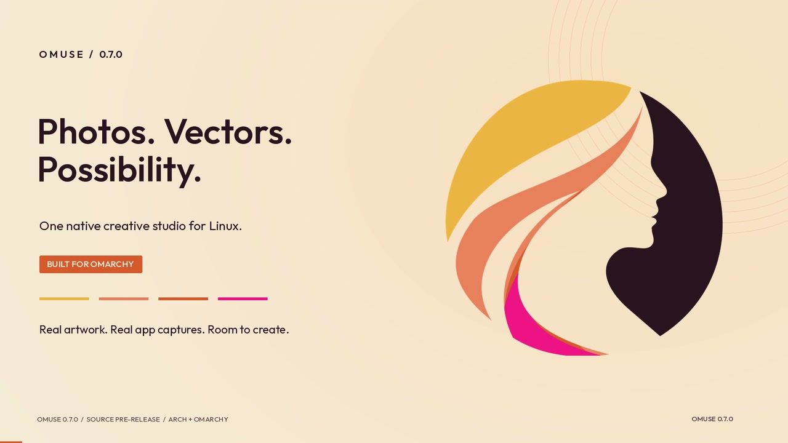

# Omuse 0.7.0 — Photos. Vectors. Possibility.

[Watch or download the two-minute film](https://github.com/Sugata-Software/Omuse/raw/refs/heads/main/docs/media/omuse-0.7.0-studio-film.mp4)
· [Illustrated user manual](../user-guide/README.md)
· [Screenshot gallery](../releases/v0.7.0-gallery.md)



The 0.7.0 film combines actual Linux app captures, four native photo-editing
comparisons, six branded pages and an Omuse motion export. The warm paper,
plum and sunset palette follows the selected Omuse identity. The interface
captures retain their own light or dark Omarchy theme.

Camera moves, typography, comparison wipes and transitions are editorial
animation. The app views are real screenshots rather than recordings of each
gesture. The AI segment shows the offline interface; no new provider request
was made for this film. There is music, with no spoken narration.

## Chapters and text companion

The MP4's chapter markers follow the timings below; the table summarises the
on-screen story. The companion
[WebVTT captions](omuse-0.7.0-studio-film.vtt) describe the sequence for players
that accept a sidecar caption track.

| Time | What the film shows | Try it in Omuse |
| --- | --- | --- |
| 00:00 | **Photos. Vectors. Possibility.** One native creative studio for Linux. | [Your first edit](../user-guide/README.md#your-first-edit) |
| 00:07 | **Find the light.** A mountain lake changes through editable exposure and colour-balance layers. | [Tone and colour](../user-guide/photo-editing.md#improve-tone-and-colour) |
| 00:18 | **Shape the contrast.** A flower becomes warm monochrome with channel mixing and curves. | [Photo adjustments](../user-guide/photo-editing.md#improve-tone-and-colour) |
| 00:26 | **Choose the focus.** A city scene uses Gaussian blur through a retained layer mask. | [Masks](../user-guide/photo-editing.md#extend-a-painted-mask) |
| 00:34 | **Change the feeling.** A gradient map remaps the flower's palette. | [Editable effects](../rust-advanced-workflows.md) |
| 00:42 | **Shape every idea.** Pen, Nodes and Move share the photo canvas; multiple objects retain their styles. | [Draw and refine paths](../user-guide/photo-vector.md#draw-and-refine-an-editable-path) |
| 00:51 | **Pixels to possibilities.** Image Trace offers local detail controls and editable curves. | [Trace an image](../user-guide/photo-vector.md#turn-an-image-into-editable-vector-artwork) |
| 01:00 | **Make colour deliberate.** Target Colour Uniformity and Camera Raw controls. | [Target a colour](../user-guide/photo-vector.md#make-a-product-colour-more-consistent) |
| 01:06 | **One idea. A whole collection.** Six native pages, followed by the current Create workspace. | [Build a branded post](../user-guide/create-content.md#build-a-branded-post) |
| 01:18 | **Your brief. Your choice.** Choose a connection and review the result. Offline interface demonstration. | [Ask Omuse](../ai-experience.md) |
| 01:27 | **Give it motion.** An actual release-build page animation, followed by Motion controls. | [Make a short animation](../user-guide/create-content.md#make-a-short-animation) |
| 01:36 | **Ready to share.** Export the content set and keep the editable `.omuse` project. | [Content packs](../user-guide/create-content.md#turn-it-into-a-carousel) |
| 01:45 | **Stay in flow.** Ctrl+K searches tools, commands and shortcuts. | [Keyboard reference](../keyboard-shortcuts.md) |
| 01:52 | **Make the next thing.** Install, learn and create. Music attribution appears on screen. | [Install Omuse](../install.md) |

## Music and media credits

**“Night Owl” by Broke For Free**, from *Directionless EP* (2011), accompanies
this cut. The 120-second soundtrack is retained from the earlier Sunset Muse
film: its encoded AAC audio packets are copied without re-encoding.

- [Artist and recording](https://brokeforfree.bandcamp.com/track/night-owl)
- [Free Music Archive source](https://freemusicarchive.org/music/Broke_For_Free/Directionless_EP/Broke_For_Free_-_Directionless_EP_-_01_Night_Owl/)
- [Creative Commons Attribution 3.0 Unported](https://creativecommons.org/licenses/by/3.0/), supplied with the downloaded recording

The recording was excerpted, edited, crossfaded, faded and level-adjusted for
the original Sunset Muse mix. This cut preserves that mix. The artist is
credited on screen, in the MP4 metadata and here. No endorsement is implied.
The saved recording's embedded copyright identifies CC BY 3.0; the artist page
currently links to CC BY 4.0. The retained recording and its original grant
remain the source for this film. The artist page and CC BY 3.0 terms were
rechecked on 2 October 2026; the FMA page did not allow a fresh automated fetch.

The photographs retain their own licences:

- **Mountain lake:** Willian Justen de Vasconcellos,
  [Reflection of Mountains on the Lake](https://www.pexels.com/photo/reflection-of-mountains-on-the-lake-23531520/),
  [Pexels licence](https://www.pexels.com/license/).
- **Yellow flower:** engin akyurt,
  [Yellow flower with black background](https://unsplash.com/photos/yellow-flower-with-black-background-C6dfdchoYbI),
  [Unsplash licence](https://unsplash.com/license/).
- **City at dusk:** Marko Milivojevic,
  [Aerial cityscape](https://pixnio.com/media/aerial-cityscape-overlook-street-roof),
  supplied as [CC0](https://creativecommons.org/publicdomain/zero/1.0/).

The earlier [media provenance record](omuse-sunset-muse-credits.md) retains
the original source and licence review. For this cut the four saved photo
projects and six branded pages were exported again through the installed
0.7.0 runtime. Original photo files and saved project trees were preserved.
The application's MIT licence does not relicense the music or photographs.

Typography: **Outfit**, [SIL Open Font License 1.1](../../rust/licenses/Outfit-OFL-1.1.txt).
Omuse artwork and the Muse mark follow the [project identity](../branding/sugata-retro.md).

## Production and verification

Picture: **1920 × 1080, 30 fps, 120 seconds**, H.264, yuv420p, fast-start MP4.
Sound: retained stereo AAC at 48 kHz. The movie has 3,600 video frames and 14
chapter markers. The supplied poster is decoded from the finished movie.

The [media receipt](omuse-0.7.0-studio-film-receipt.json) records output hashes,
full decode, audio preservation, screenshot sources, native photo exports and
the production runtime. The application qualification remains in the
[0.7.0 release record](../release-070-qualification.md).

The [render script](../../scripts/render-studio-film.py) requires Python with
Pillow and NumPy, plus FFmpeg/FFprobe. Run it with an explicit production asset
folder and output folder; `--render` encodes after producing the storyboard:

```sh
python3 scripts/render-studio-film.py \
  --assets /path/to/approved-film-sources \
  --output /path/to/film-output --render
```

The production asset folder supplies `photo-{grade,mono,focus,colour}-{before,after}.png`,
`page-1.png` through `page-6.png`, `splash-muse.png` and `native-motion.mp4`.
The script reads current screenshots, the Outfit font and the existing credited
soundtrack from the repository. It does not download media or contact AI providers.
The receipt identifies the exact inputs used for the published cut; a clean
source checkout alone does not contain the large photo project masters.
