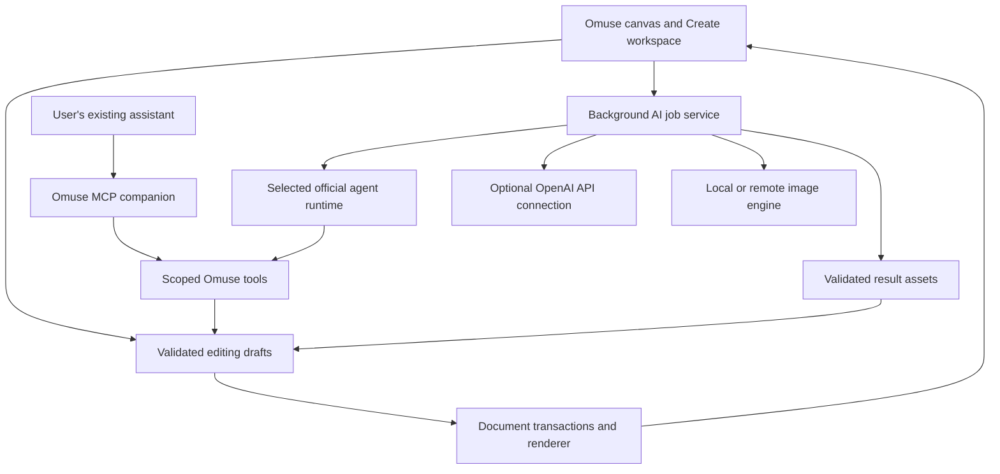

# Omuse Create and AI plan

Date: 2026-09-28. Status: implemented local preview on `feat/omuse-create-ai`; [candidate identity and evidence](omuse-create-qualification.md). The full content scope remains confirmed by the user; the installed application and `rewrite/rust-gpui` remain preserved. The [Create guide](omuse-create-guide.md) describes the native workflows. Local evidence now covers the Rust suite, Create recovery, all template variants, media, native/XWayland journeys and a bounded Codex subscription journey. Public release gates, manual review and per-provider qualification remain open. This document is not a release certificate.

## Product decision

Omuse makes content. Calendars and scheduling are excluded. Social publishing, account management and performance analytics are outside this plan. Captions, subtitles, alt text, campaign briefs and export metadata remain useful content assets.

Build a native Create workspace alongside the existing photo-editing workspaces. Keep Rust, GPUI, gpui-omarchy theme integration, local projects, reversible editing and responsive operation. Extend the current engine and preserve the existing application and project compatibility paths.

The intended experience is: choose a brand, bring in some content, describe the result, refine it directly on the canvas, and export an editable campaign. The assistant should understand the selected objects and use the appropriate editing tool. Generated pixels are one material in a design; headings, logos, frames and layouts remain native objects wherever possible.

The user's subsequent clarification makes the in-app boundary explicit: generation and control belong inside Omuse. Omuse owns connection selection, prompts, references, progress, results and follow-up edits. Provider clients may run as background processes. A separate terminal, another chat application, manual download or file handoff is not part of the primary workflow. Provider-owned sign-in may briefly open a browser when a connection genuinely needs authentication.

Provider choice is also an explicit requirement. The user has a Claude subscription as well as ChatGPT/Codex access and wants to choose Claude, Grok or other services. The core must work through interchangeable providers from the start. Codex is the first locally evidenced adapter, not a mandatory account, a hidden router for other providers or a requirement for native editing.

The latest preference narrows the initial connection scope: prioritize existing subscriptions; OpenAI is the only optional direct API integration in the initial release. Other paid API adapters and custom API endpoint UI are deferred. Extensibility remains in the architecture without turning the product into a catalogue of separately billed services.

## Confirmed content roadmap

| ID | Capability | Deliverable |
| --- | --- | --- |
| C01 | Pages, artboards and carousels | Multiple page sizes in one project, page strip, reorder/duplicate, numbering, shared backgrounds and cross-slide compositions. |
| C02 | Brand kits | Multiple brands; logos, colour roles, font pairings, text styles and spacing rules. Sugata is the first worked example. |
| C03 | Editable templates | An initial set of 20 original templates covering testimonials, announcements, educational carousels, events, case studies, offers and thumbnails. Named content fields, protected brand elements and layout constraints. |
| C04 | Typography and layout | Styled text ranges, reusable heading/body styles, alignment and distribution, text backgrounds, fitting with minimum readable sizes, overflow reporting and font substitution handling. |
| C05 | Frames and collages | Replaceable images in frames/grids, independent crop transforms, focal points, rounded boundaries and nondestructive replacement. |
| C06 | Social previews and exports | Phone-size previews, maintained safe-area presets, crop/overflow checks, ordered PNG/JPEG/WebP exports, multipage PDF and a complete export package. |
| C07 | Layout resizing | Adapt compositions across aspect ratios while retaining live text/shapes, subject framing, spacing and editable overrides. |
| C08 | Reusable components | Shared logos, badges, footers and calls to action; instance overrides; explicit update propagation. |
| C09 | Bulk design creation | CSV first, then additional data formats; bind columns to text/images/visibility, validate rows, preview variants and export with meaningful names. |
| C10 | Local asset library | Photos, cutouts, logos, backgrounds, icons and saved compositions with search, tags, favourites, provenance and project packaging. |
| C11 | Cutout workflows | Make existing local subject selection, edge refinement, background replacement and shadow/effect tools accessible as one coherent workflow. |
| C12 | Motion | Layer entrance/exit, fades, pans, text animation, page durations, transitions and MP4/GIF output. |
| C13 | Short clips and subtitles | Clip trim/split, audio, editable subtitles and subtitle import. Transcription remains an optional, separately qualified capability. |

There is no calendar milestone. Content sets may have names, briefs and versions without acquiring dates, publishing states or scheduling controls.

### Historical baseline

The following was true before the Create work began: whole-image resizing rasterized live objects, a document held one canvas, recipes processed images without a data-binding system, linked raster sources were not reusable nested components, and the launch animation was not a motion authoring/export engine. It is historical planning context, not a description of the current Create source. Current foundations and older workflows remain documented in [the Rust README](../rust/README.md) and [advanced workflows](rust-advanced-workflows.md).

## Source coverage and local-preview qualification

This map distinguishes implemented paths from **local-preview evidence** collected on the final candidate. A local pass proves the named bounded fixture or journey only. It does not make a capability public, universal across machines or providers, or exempt from the public-release and manual gates below.

| ID | Implemented path and local-preview evidence | Remaining public/manual gate |
| --- | --- | --- |
| C01 | `create_project` and **Pages** provide packaged multi-page collections, page selection, add, duplicate, reorder, shared backgrounds and collection history. `create-recovery-qualified-b178ad2/results.json` passed six save/reopen revisions of a six-page branded package with native text, resources, shared background and components; a staged-save SIGKILL retained complete old destination and complete new recovery snapshots. | Review ordinary collection editing and concurrent-save UX before public distribution. Installed native checks have passed. |
| C02 | Brand kits store colour roles, font pairings, text styles and spacing tokens; **Brand** applies them across a collection. Sugata branding survives the six-page recovery and assistant-carousel evidence. | Manual missing-font/substitution behavior and a real multi-brand handover remain to be reviewed. |
| C03 | `create::TEMPLATE_CATALOG` contains 20 editable native templates under **Design**. The final catalog rendered, saved, reopened and pixel/native-checked all 80 original, square, story and wide outputs. The 76 unchanged outputs match the previously reviewed catalog; the four final Video Title variants received a focused contrast/containment review and passed. | New template copy or geometry still requires its own visual and accessibility review. |
| C04 | Native live text, fitting, text backgrounds, alignment, distribution and layout controls are implemented. The Rust suite and final catalog exercised fixed-box text and responsive native layout. | Manual rich-run editing, unusual fallback fonts and assistive use remain release review items. |
| C05 | Frames retain source and crop transforms, with frame replacement and packaged resources. Create/recovery evidence preserves packaged source resources and native fields through save/reopen. | Manual focal-point, rounded-frame and replacement review across user-supplied assets remains. |
| C06 | **Export** provides ordered PNG/JPEG/WebP, PDF, captions, alt text, a manifest, phone preview and guides. The Create acceptance and media evidence produce real export artifacts. | Review destination behavior, filename collisions and representative user content on the target system. |
| C07 | `resize_layout` adapts live objects and component groups; native commands can resize a page. C03's 80 outputs cover square, story and wide responsive variants without losing native text/pixels. | Manual art-direction review is still needed for new user-authored layouts. |
| C08 | Project components have definitions, instances, text/visibility overrides and explicit propagation. The six-revision recovery fixture preserves two components, shared backgrounds and package integrity through save/reopen and staged-save SIGKILL. | Nested-instance conflict and editor UX review remain public-release work. |
| C09 | CSV parsing, typed text/image/visibility/alt bindings, row validation, transient preview and bounded bulk creation are implemented; image bindings use packaged resources only. | A representative user batch, row-error presentation and final export naming remain manual acceptance work. |
| C10 | The local asset library supports import, thumbnails, search, tags, favourites, provenance and project packaging. Recovery/acceptance packages preserve validated resource bytes. | Large/damaged library and cross-project reuse review remains. |
| C11 | **Assets** places library assets and enters local background removal; the advanced editor provides refinement, local removal/healing and effects. | Edge quality, discovery and one coherent cutout journey need manual visual acceptance. |
| C12 | **Motion** supplies duration/FPS, layer entrance/exit presets, transitions, preview and MP4/GIF output. `media-b178ad2/results.json` passed real 640×480 timed exports; actual 800×600 XWayland and strict splash/native-window journeys passed. | Broader device/theme timing and cancellation review remains before public release. |
| C13 | Motion supports audio range/offset/volume, editable SRT/WebVTT, soft/burned subtitles, trim and two-clip split output. The media fixture passed audio decode, selectable/burned subtitle exports and trim/split artifacts. Automatic transcription is not implemented. | User-media compatibility, cancellation and destination non-overwrite review remain. |

| ID | Implemented path and local-preview evidence | Remaining public/manual or provider gate |
| --- | --- | --- |
| A01 | **Generate image** uses a bounded job, staged context/review path, persisted **Local-only**, honest route/billing labels and local qualification receipts. The current Codex journey restored and reviewed a retained real Generate result from the previous candidate without making another Generate request; it also submitted a new Background request. Result provenance and native preservation were verified. | This is local evidence for the named Codex runtime only, not public support for every account, runtime version or provider. |
| A02 | **Replace selection** stages canvas, selection and mask for a reversible draft. | A separate live replacement/mask-alignment run is still required; do not advertise it as qualified merely because its UI exists. |
| A03 | **Background** is an explicit intent; native product finishing remains local. The bounded Codex journey preserved the protected subject byte-exactly, kept/reopened the result and restored it with Undo. | Broader product/backdrop quality and other provider routes remain unqualified. |
| A04 | **Expand canvas** supports independent 0–4096 px margins within processing limits. | No local live expansion receipt exists; its eligible route remains **Try canvas expansion**, otherwise unavailable. |
| A05 | **Remove selection** has an AI intent; local removal/healing is separately available. | Remote removal remains unqualified; local tools do not prove an AI route. |
| A06 | The reference tray sends only selected reference assets with document context. | Brand continuity, provider limits and data handling remain per-provider qualification work. |
| A07 | Requests can ask for 1, 2 or 4 sequential variations with comparison/follow-up controls. | A bounded multi-variation cancellation run remains required. |
| A08 | **Design with me** produces reviewed transactional native plans, including existing-page selection, packaged-resource placement and bounded component overrides. The final Codex journey produced a branded editable six-page carousel and passed Keep, save/reopen, Undo and Redo. | Provider-produced plans beyond the evidenced Codex runtime require their own live qualification. |
| A09 | **Improve layout** and deterministic preflight cover overflow, missing fonts, guides, missing descriptions, conservative collision/spacing and known-background contrast. | Critique quality and failure messaging remain to be reviewed per route; unknown backdrops and rich-text colour runs remain deliberately conservative limits. |
| A10 | Native page resize/layout adaptation exists; C03 exercises target variants. | Assistant-led resize/expansion is not locally qualified. |
| A11 | CSV bulk creation is native and makes no model calls for local substitution. | A user-facing testimonial batch with row failures, previews and named exports remains acceptance work. |
| A12 | Motion has native timing/presets, and commands can describe page animation. The live assistant plan included a 2-second fade that survived apply and save/reopen. | That assistant-authored animation still needs its own render acceptance; generative video is outside this scope. |
| A13 | Local restoration provides denoise, sharpen and 1×/2×/4× drafts while retaining the hidden original. | High-precision source and visual-quality acceptance remain. |
| A14 | Captions and alt text are native content fields exported with the content pack; **Draft caption & alt text** prepares both from a canvas preview. The live six-page assistant plan supplied both fields through Keep, save/reopen, Undo and Redo. The local Create journey separately exported these fields. | The standalone drafting action, wider brand-voice quality and accessibility review remain to be qualified. |

A control labelled **Try ...** is available only for a selected route that can attempt a not-yet-tested capability under the user's explicit allowance/billing choice. **Unavailable** means the selected route cannot provide the operation; the application must not substitute another provider. Subscription runtimes, external API access, automated transcription and any paid image/video operation remain gated by their own capability, billing, isolation and live-operation qualification.

## AI experience

### One contextual entry point

Provide an Ask Omuse field in the workspace, a compact prompt beside an active selection, and a keyboard command palette. Show the target clearly: selection, layer, page or content set. The expanded assistant panel retains the conversation and results; it should not obscure the artwork while work runs.

Supply the chosen brand, relevant objects, a bounded preview and the requested references. Do not make the user restate colours, canvas size or which layer they selected. Show a small reference tray so the user can see and remove what will be sent.

Use direct controls for common actions: Generate, Replace, Expand, Background, Variations and Improve layout. Follow-up instructions such as "warmer", "keep the subject", "less busy" or "use the second version" act on a particular result with a stable identity.

On first connection, explain where artwork is processed and how usage is billed. Remember that choice. Subsequent ordinary requests should not require repeated setup or permission prompts within the chosen scope. Show the provider/usage mode beside the action and expose advanced choices on demand.

### The complete in-app journey

1. Open Connections from the assistant panel. Show detected integrations with honest states: installed, signed in, capability verified, needs sign-in or unavailable. On this host, ChatGPT through Codex is the first candidate. Do not infer the other account subscriptions from installed executables.
2. Choose Use existing connection. Omuse asks the official runtime for account/capability status and keeps credentials under that runtime's management. Offer its official sign-in flow only when needed. Connecting must not automatically run a chargeable image-generation test.
3. Return directly to the artwork. Select or brush an area and choose Replace, Background or Generate. The selection boundary, reference thumbnails, brand and concise billing label remain visible beside the prompt.
4. Enter a request such as "warm terracotta studio, softer light, keep the product". The connection chosen by Auto must be shown before submission. Auto can select only capabilities and destinations the user has enabled.
5. Show real job stages in the canvas/result tray, with Cancel and the ability to keep editing. Avoid invented progress percentages or treating a stalled provider as completed.
6. Present the result already aligned in a reversible draft. Compare the source, correct the edge mask, Keep the result or request another direction. A file path or a chat message alone is not a successful image action.
7. Continue with "less saturated", "use this across the carousel" or "make a story version". The assistant follows the chosen result and document context; native changes use local tools and keep text and components editable.
8. Reopen the project later with its kept alternatives, provenance and editing state intact. A failed or expired provider connection does not prevent opening or editing the artwork.

Connections is a settings drawer, not a permanent bank of provider dashboards. Default controls describe the creative action. Provider/model choices, available usage information and connection diagnostics are available when useful. Omuse does not require its own cloud account for this workflow.

The drawer supports multiple simultaneous connections and separate defaults for Assistant, Images and, later, Video/Transcription. For example, a qualified Claude connection can interpret a brief and operate native layout tools while a chosen image connection supplies the background. The user can override the provider for one action. Auto selects only among the enabled routes and shows the actual selection; it must never secretly route every provider through OpenAI.

Add another provider initially supports qualified official subscription runtimes, with an optional local engine later. A separate Advanced connection offers OpenAI API access. Compatibility is declared per operation: a reasoning connection does not automatically support masks, generated images, streaming or video. Future adapters use the same validation and job service as built-in adapters.

### Creative capabilities

| ID | User request | Intended behaviour |
| --- | --- | --- |
| A01 | "Create a warm editorial background for this post." | Generate an asset to the requested framing and brand direction, then add it as a new layer or populate a frame. |
| A02 | "Replace this object with a ceramic vase." | Send a selection crop plus suitable surrounding context; validate and align the result; composite it through an editable local mask. |
| A03 | "Put this product in a sunset studio." | Retain the original product cutout and logo pixels; generate a separate backdrop, with optional shadow/reflection layers. |
| A04 | "Make this image wide enough for the banner." | Generate missing surroundings, retain original pixels in their original area, and expand the canvas using a reversible draft. |
| A05 | "Remove the distracting object." | Use local healing/removal when suitable and generative patching when needed. Keep the original and allow mask correction. |
| A06 | "Make this reference feel like our brand." | Use explicitly selected reference assets and brand direction. Retain a reference set for subsequent variants; avoid promising exact identity or composition reproduction. |
| A07 | "Show another direction." | Create named alternatives in a comparison tray. Offer an explicit count for multiple variations and show their usage implications before submission. |
| A08 | "Turn this brief into a six-slide carousel." | Draft copy and a structured composition using native text, frames, components and layout constraints. Generate only the imagery needed by that composition. |
| A09 | "Make this clearer and more refined." | Combine deterministic checks for overflow/contrast/spacing with a model's visual critique; show a preview of proposed edits. |
| A10 | "Make square and story versions." | Use native layout resizing, optionally guided by the assistant. Generate expansion only if the composition needs new image area. |
| A11 | "Make these 30 testimonials into posts." | Bind supplied data to an approved template, validate every row and preview/export. Do not make 30 model calls when one template plus local substitution suffices. |
| A12 | "Animate this announcement." | Use native animation presets and structured timings, then render through the motion pipeline once C12 exists. Generative video is an optional later provider capability. |
| A13 | "Restore or enlarge this image." | Offer qualified denoise/upscale/restoration tools, preserving the source and identifying generated detail rather than implying recovery of known original detail. |
| A14 | "Write captions and alt text for these assets." | Draft content linked to each asset, using the supplied brief and brand voice; preserve user edits and export text alongside the files. |

Keep headlines, exact wording, prices and logos outside generated background images by default. Native objects provide exact spelling, reliable layout, accessible editing and consistent brand assets.

Optional later input: push-to-talk commands using an explicitly connected transcription route. A microphone is not required for the core experience.

### Results and preservation

Generated alternatives remain separate from the source. Provide before/after comparison, Keep, Refine, Save to library and Discard. A successful request should produce visible artwork, not merely a chat response containing a path.

For replacement, the local compositor must preserve pixels outside the effective edit mask. Feathering defines an explicit transition band. Preserve protected subjects by reusing their original layers above a generated background. A prompt alone cannot guarantee preservation inside an edited region; review results visually and do not advertise perfect identity retention.

Record the source revision, mask, references, prompt, provider/model, available parameters and returned assets. Repeating a prompt is not guaranteed to reproduce the same image. Undo restores document state; it does not reverse provider usage.

## Use the user's existing access

Omarchy makes local process and tool integration convenient. Subscription entitlement still comes from each provider. Discover installed clients and supported authentication state through their own interfaces; installation alone is not evidence of a paid account or an image capability.

### Provider choices

| Route | What is established | Planned treatment |
| --- | --- | --- |
| ChatGPT subscription through Codex | Official documentation supports ChatGPT sign-in for Codex, app-server integration in another product, and built-in image generation charged to Codex usage. | First integration. Let the official Codex runtime own authentication and token refresh; reuse its existing sign-in when available. Qualify image generation and result delivery end to end before presenting it as ready. |
| OpenAI API | API-key use has separate usage-based billing. | The only optional direct API adapter in the initial release, explicitly connected by the user. Never silently switch a subscription request to API billing. |
| Claude Code | Anthropic distinguishes users signing into its unmodified CLI from third-party applications handling subscription credentials. | Prioritize an in-app adapter through the unmodified official runtime, conditional on verifying the complete embedding and authentication against those documented conditions. Do not offer an Omuse-owned Claude.ai login or intermediate subscription tokens. A direct Claude API adapter is outside the initial scope. |
| Grok Build / SuperGrok | xAI documents subscription access to Grok Build and an ACP interface for embedding the agent in other applications. | Include a native Grok adapter using the official runtime and its sign-in. Qualify its image-generation capability separately; ACP support alone does not establish access to subscription-funded Imagine output. |
| Grok Imagine API | xAI documents image generation/editing APIs and separate API billing. | Research context only; a direct API adapter is outside the initial scope. Do not equate a SuperGrok login with verified API funding. Investigate the official subscription runtime's capabilities instead. |
| Gemini CLI / Google AI subscriptions | Gemini CLI supports sign-in with Google AI Pro/Ultra accounts. The documented Nano Banana extension separately requires a Gemini API key. | Optional in-app assistant adapter after verification. Treat image generation and CLI reasoning as distinct capabilities and billing routes; do not label Nano Banana API calls as subscription-covered. |
| Other image APIs | Capabilities, authentication, prices and model licences differ. | Deferred. Keep the adapter contract extensible without shipping more direct paid APIs in the initial release. |
| Local or user-controlled ComfyUI | ComfyUI exposes local HTTP/WebSocket execution interfaces. | Optional later adapter with qualified workflows, explicit endpoint selection and hardware checks. A remote engine is a separate data destination even if owned by the user. |

Sources: [Codex authentication](https://learn.chatgpt.com/docs/auth), [app-server](https://learn.chatgpt.com/docs/app-server), [image generation](https://learn.chatgpt.com/docs/image-generation), [usage and pricing](https://learn.chatgpt.com/docs/pricing), [Claude Code integration/authentication conditions](https://code.claude.com/docs/en/legal-and-compliance), [Grok Build subscription and integration announcement](https://x.ai/news/grok-build-cli), [Grok ACP/CLI interface](https://docs.x.ai/build/cli/reference), [Grok API account billing](https://docs.x.ai/developers/faq/accounts), [Grok Imagine capabilities](https://docs.x.ai/developers/model-capabilities/imagine), [Gemini authentication](https://geminicli.com/docs/get-started/authentication/), [Nano Banana extension](https://github.com/gemini-cli-extensions/nanobanana/blob/main/README.md), [ComfyUI routes](https://docs.comfy.org/development/comfyui-server/comms_routes). Verified on the date above; recheck before shipping each adapter.

Consumer-only image services can have an explicit export/import handoff until a supported integration exists. Do not ship cookie extraction, private endpoint emulation, or automated login workarounds as the foundation of a subscription adapter.

### Runtime adapters inside Omuse

The primary experience is an app-owned conversation using the selected provider, a scoped document context and Omuse editing tools. Generation is requested from Omuse, completion events return to Omuse, and Omuse imports and presents the image automatically. A provider runtime is a background dependency; its terminal interface is not the product UI.

Initial transport candidates are Codex app-server over stdio, the unmodified Claude Code streaming interface subject to embedding qualification, Grok Build ACP over stdio, and optional OpenAI API access. Each translates its events into the same Omuse job, tool and asset representations. Provider-specific sessions remain behind the adapter boundary.

An assistant that cannot generate raster images directly can still control Omuse's native tools and ask Omuse's job service to use the user's chosen image-capable subscription. For example, Claude could direct the layout and request an image through an independently connected Codex runtime. Omuse supplies a bounded image task and imports the result; Claude does not receive the other provider's credentials. This cross-provider composition is a proposed integration to qualify, not a promise that all providers' subscription allowances are interchangeable.

The same Omuse MCP tool surface could later support an optional external assistant companion. That is an extension, not a prerequisite, release substitute or workaround for the in-app generation requirement.

The same account does not automatically transfer this conversation, every saved memory or all connected applications into Omuse. The app-owned conversation keeps its own project context. Explicitly chosen briefs and references provide continuity.

The initial adapter should use a child process over stdio. Official app-server documentation supports this integration surface, but the installed CLI marks app-server experimental. Pin and qualify a supported version range, generate matching schemas, and treat protocol compatibility as a release gate. Avoid exposing an unauthenticated network service.

### Capabilities and routing

Each adapter reports authentication state, available operations, supported input/reference formats, masks, output sizes, transparency, cancellation behaviour, usage information and billing mode. Store whether each field is verified, unavailable or unknown, plus its last check time. A feature flag is not account entitlement.

Use a simple policy by default:

1. Perform exact edits such as text changes, spacing, masks, crops and exports locally.
2. Use the selected subscription route for reasoning and generation when that route supports the task.
3. Offer an explicitly connected alternative if the first route lacks a capability or reaches a limit.
4. Require the user's chosen billing/data policy to permit any provider change. Never silently send assets to a different service or activate separately billed access.

Display modes such as Uses your ChatGPT allowance, Separate API billing, On this computer and Remote engine. Do not promise a fixed number of images from a token allowance, a dollar price when unknown, or unlimited subscription use. Codex image generation shares the allowance used elsewhere in Codex; provider credits may also be consumed according to account settings. A local preflight cannot guarantee a strict included-only cap when the provider does not expose an enforceable cap or other clients consume the same allowance concurrently.

Use provider rate-limit data when available, support session/batch limits and stop further submissions at the configured boundary. Do not purchase top-ups automatically. Unknown usage remains visible as unknown. A remote cancellation can stop Omuse waiting without necessarily preventing provider billing.

## Native architecture

### Document foundations

Introduce a versioned project envelope containing pages, shared assets, brand references and reusable components. Reuse the existing per-page document and rendering engine. Legacy single-canvas documents open through a compatibility path; new data must not be silently discarded by a legacy export or save.

Add semantic objects for rich text, image frames, components, layout rules and content bindings. Store constraints and per-format overrides so resizing is independent of pixel resampling. Render and export through the same evaluated state. Include font availability and redistribution handling when packaging projects.

Use shared asset storage and bounded page-preview caches. Keep inactive pages lazy; do not allocate a full-resolution composite for every carousel page and variant. Extend undo, atomic save and recovery to encompass shared components and multi-page changes.

### AI jobs

Suggested implementation boundaries, subject to the existing module structure:

- `ai/providers`: typed capabilities, provider adapters and authentication/status operations.
- `ai/jobs`: persistent request identities, bounded execution, cancellation, progress, recovery and usage accounting.
- `ai/context`: selection crops, masks, brand context, reference assets and structured document summaries.
- `ai/results`: decoding, bounds validation, source mapping, provenance and immutable alternatives.
- `ai_ui`: contextual prompts, result tray, comparison, connection status and usage labels.
- `automation`: semantic editing commands, transaction validation and the MCP companion.

Keep provider sessions and document state separate. Switching assistants uses a user-visible project brief, relevant conversation summary and selected references, rather than pretending the providers share a native conversation ID or private reasoning. Retain the user's actual prompts and document changes; switching must not discard artwork or require recreating the project.

Every job records document/page IDs, source revision, affected object IDs, crop transforms, asset hashes, requested operation, provider and result state. Use an explicit lifecycle: queued, submitting, running, result-ready, applied, cancelled, failed or outcome-unknown. Closing a document or changing the selection must not redirect an old result to a new target.

Validate decoded image dimensions, type and resource use before import. A completed image-generation event can contain a result payload or saved path; both need validation. Copy returned files into managed project assets before applying them, and retain provenance needed to inspect the edit.

When a job finishes against an outdated document revision, retain it in the result tray and revalidate placement; do not overwrite intervening edits. Applying a complete draft is a single undoable transaction. Multi-page operations should be staged as a coherent set rather than leaving half-edited pages on failure.

Separate network/model execution from the GPUI event loop. Start with one heavy generation at a time on this host. Render thumbnails and comparison previews at bounded resolution, release unused full-size buffers and support cancellable export jobs. No model download or service startup on ordinary app launch.

Retries need to distinguish safe read/status calls from possibly billable submissions. If a submission times out after reaching the provider, recover through its job identity when supported; otherwise report an unknown outcome before resubmitting. Do not blindly repeat expensive generation calls.

### Scoped editing tools

Expose operations such as read document summary, render preview, create draft, edit text, place an asset, set layout, add a page, request generation, preview draft, apply draft and export assets. Use stable IDs and schemas. The model proposes parameters; Omuse enforces valid geometry, object types, revision checks and resource limits.

Use authenticated local IPC between the tool server and the selected editor instance, with private runtime-directory permissions, peer checks and per-session capabilities. Bind tool access to the chosen project/window. Plain text in imported templates, image metadata or documents is content, not authority to call unrelated tools.

Prefer MCP for the first portable tool bridge. Dynamic app-server tools can be evaluated later; they are experimental and require a separately qualified protocol path. Reuse provider-managed sign-in without copying tokens into Omuse project files. Optional API credentials belong in the desktop secret store, never artwork or logs.

Qualify runtime permissions independently of prompting: disable unneeded shell, application and network tool access, use a dedicated job working directory, and test actual access boundaries. Do not inherit all of the user's connected applications, filesystem permissions or assistant history merely because the same sign-in is reused. If those boundaries cannot be enforced by an embedded route, keep the companion workflow explicit and mark the embedding gate unresolved.

Transmit only the chosen artwork and necessary context. Strip unnecessary metadata such as location from temporary provider inputs. Preserve originals locally. Make provider destinations and project-level local-only preferences visible. Diagnostics redact secrets, personal paths and artwork unless deliberately included by the user.

## Evidence from this machine

The following is local final-candidate evidence from 2026-09-27/28. It establishes bounded preview behavior, not a public release certificate.

- The final Rust qualification record reports 636 passed tests, no failures and three deliberately ignored benchmarks that were subsequently run and passed. The installed native check also passed; the qualification record lists the remaining public-release gates.
- The final template catalog passed 80 rendered/save/reopen/native-pixel checks: 20 templates across original, square, story and wide outputs. `video-title-review.md` separately confirms the four rebuilt Video Title variants retain readable white text inside the dark panel.
- `create-recovery-qualified-b178ad2/results.json` passed six revisions of a six-page branded/component/resource collection. Its coordinated staged-save SIGKILL check retained complete old and new package snapshots; it is filesystem/process qualification, not power-loss simulation.
- `media-b178ad2/results.json` passed MP4 audio, soft/burned editable subtitle, trim and split fixtures. Native journeys cover Create, Motion, Export and Assistant; the actual XWayland window was checked at 800×600 and the strict splash sequence passed.
- `native-ai-b178ad2/verified-native.json` records restoration/review of the retained real Generate result and a new Background request, including protected-subject byte equality, native Keep, save/reopen and Undo. It also records a new six-page editable assistant carousel. The original Generate request was made on the preceding candidate. This evidence does not qualify a different Codex version, another account or another provider.
- The isolated local preview launcher is `omuse-preview`; sample projects are at `~/Pictures/Omuse Preview`. Installed self-test, native editing and normal/desktop-entry launch passed from outside the source checkout. The original installed executable remains unchanged.

Earlier route-discovery context remains relevant: Codex 0.151.0 had existing ChatGPT authentication and image-generation capability discovery; Claude, Gemini and Grok entry points were discovered but their account entitlement, embedding and image capability were not established. No credential was copied into Omuse. The host hardware observations and optional local/remote-engine guidance below remain planning constraints, not performance claims.

Use cloud generation through the user's chosen access initially, while composition, masks, text, previews and exact edits stay local. A local/remote ComfyUI option remains opt-in and needs target-hardware benchmarking. Omarchy branding does not justify promising fast local diffusion.

## Delivery sequence and local-preview status

| Stage | Work | Exit criterion |
| --- | --- | --- |
| 0: Prove connections | Implement the provider-neutral contract and in-app Connections prototype. Prove Codex image transport with existing sign-in; qualify Claude runtime/authentication/tool control as the user's other named subscription; inspect Grok ACP as the next runtime. | Request one new asset and one supplied-image edit from inside Omuse without manual file handling. Demonstrate a second assistant controlling the same native editing commands when its route qualifies; otherwise record the exact unresolved provider gate. Verify cancellation, login expiry, capability reporting and billing identity. |
| 1: First useful AI slice | Job service, contextual selection prompt, reference tray, new-layer generation, background replacement, alternatives and undo/save/reopen. | Select a background, describe a replacement, compare and keep it while the original subject remains unchanged. No stale job can overwrite a newer edit. |
| 2: Create foundations | C01-C06 and C10-C11, rich-object persistence, branding and the initial original templates. | Create and export a complete branded six-slide carousel with native editable text, frames and a phone preview; reopen it without loss. |
| 3: Campaign production | C07-C09, linked components, layout constraints, AI composition from a brief and spreadsheet bindings. | Produce square and vertical variants, propagate one brand change, and generate a validated batch without rasterizing editable text or making unnecessary model calls. |
| 4: Broader access and polish | Qualified additional subscription adapters, optional OpenAI API connection, optional image engine, asset packaging and restoration/upscale workflows. An external assistant companion is optional later work. | Each advertised route passes the same in-app capability, billing, preservation, failure and restart checks. Unavailable connections degrade clearly while ordinary editing remains usable. |
| 5: Motion | C12-C13, structured animation assistance, subtitle workflows and optional voice input. | Export a short branded animation/video with correct timing, editable text/subtitles, cancellation and repeatable native renders. Generative video remains separately qualified. |

The table remains the delivery roadmap. Local preview evidence now covers substantial parts of stages 0–5: multi-page Create/recovery, templates/resizing, packaging, media and one Codex route. It does not collapse the remaining work into a public-release claim: unavailable routes stay unavailable, eligible but unevidenced operations stay explicit **Try** operations, and manual compatibility review remains required.

Stage 0 is deliberately first: native subscription-funded image transport, interchangeable providers and scoped execution must be demonstrated before the rest of the experience depends on them. Development effort estimates should follow that spike and the multi-page/rich-text design review. Do not promise a complete Canva/Photopea replacement from this plan alone.

## Release qualification

Local preview evidence above satisfies named portions of these criteria: the Rust suite, Create recovery, 80 template variants, media artifacts, native/XWayland journeys and a bounded Codex run. Physical hardware and display checks, clean-container/CI qualification, the licence findings, broader manual review and each advertised provider/operation remain public-release gates.

Use deterministic fixtures for tool parameters, masks, layout, serialization and transactions; use paid/live provider checks only when they resolve an actual integration question. Add independently reviewed image fixtures for quality claims.

Required checks include:

1. Masked replacement preserves all pixels outside the effective mask; protected original layers survive background generation byte-for-byte.
2. Text and logos remain editable through AI layouts, resizing, save/reopen and export.
3. Cancel, disconnect, provider failure, usage limits and app restart retain source artwork and any completed alternatives.
4. Duplicate events and retries cannot double-apply edits or silently create duplicate paid requests.
5. Jobs completing after a document edit, close or window switch cannot mutate the wrong target.
6. Missing fonts, long copy, absent images, unusual aspect ratios and invalid batch rows yield usable previews and specific errors.
7. Offline mode retains native editing and reports unavailable remote operations clearly.
8. Provider selection and displayed billing mode match the actual runtime connection; no unselected paid or external fallback occurs.
9. Credentials, prompts and artwork do not leak into diagnostics, unrelated projects or inherited connector calls.
10. The app remains responsive while generation/export runs, with measured interaction latency and bounded memory on this host. Set numerical performance budgets after baseline measurement.
11. Minimum-window layouts, active Omarchy themes, keyboard use and reduced-motion preferences work across the Create and assistant interfaces.
12. The release candidate passes the existing editing/recovery suite plus the new end-to-end journeys; demos and screenshots come from that candidate.
13. A user can connect, request generation/replacement, compare, refine and keep artwork entirely from Omuse. No required terminal interaction, assistant-app switch or manual download/import is hidden in the success path.
14. Provider switching preserves document state and respects explicit per-role choices. Core editing and the provider registry operate with no OpenAI account configured. A Claude or Grok selection cannot silently execute through a different provider.

The flagship acceptance journey is a Sugata content set: use the brand kit, turn a supplied brief into a six-slide carousel, generate a background while retaining exact logos and headings, create square/story variants, change the headline across the set, reopen the project, and export all assets with captions and alt text. The result is content ready to use, with no scheduling workflow.
