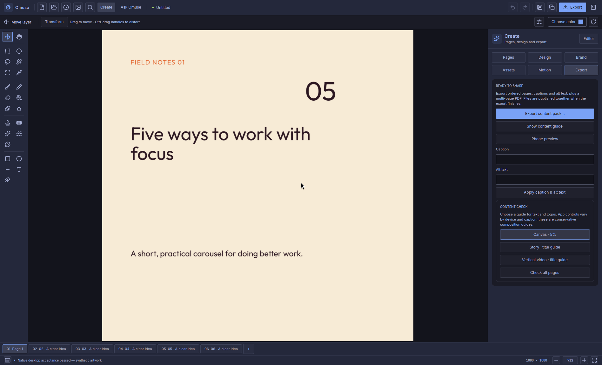
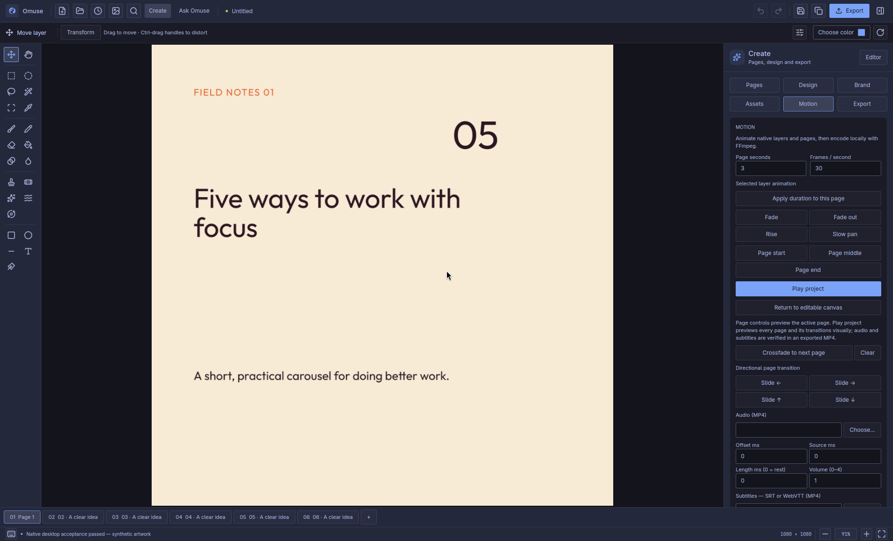

# Omuse 0.7.0 — interface gallery

Ten actual Linux interface captures from the production executable, using isolated demo artwork. Light and dark views follow gpui-omarchy. No live AI request was sent for the assistant capture.

[Release notes](v0.7.0.md) · [Qualification](../release-070-qualification.md)

## Pen and editable Bézier curves

[Open full resolution](images/v0.7.0/01-vector-pen.png)

## Multiple objects in one vector artwork layer

[Open full resolution](images/v0.7.0/02-vector-artwork.png)

## Local Image Trace and detail controls

[Open full resolution](images/v0.7.0/03-image-trace.png)

## Photo curves and Camera Raw controls

[Open full resolution](images/v0.7.0/04-photo-curves.png)

## Target colour uniformity

[Open full resolution](images/v0.7.0/05-target-colour.png)

## Create workspace and branded pages

[Open full resolution](images/v0.7.0/06-create.png)

## Ask Omuse workspace — offline demo

[Open full resolution](images/v0.7.0/07-ai-assistant.png)

## Content export

[Open full resolution](images/v0.7.0/08-content-export.png)

## Motion and video export

[Open full resolution](images/v0.7.0/09-motion.png)

## Searchable commands and keyboard shortcuts

[Open full resolution](images/v0.7.0/10-command-search.png)
