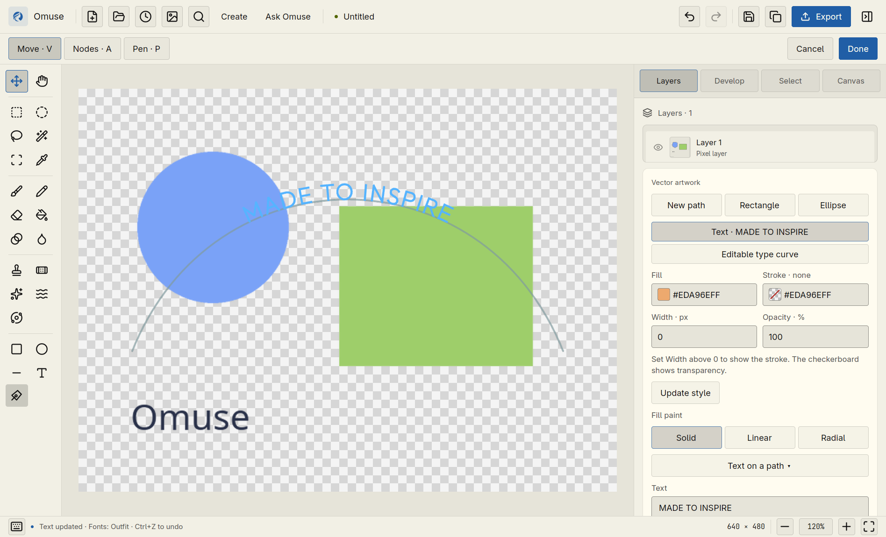
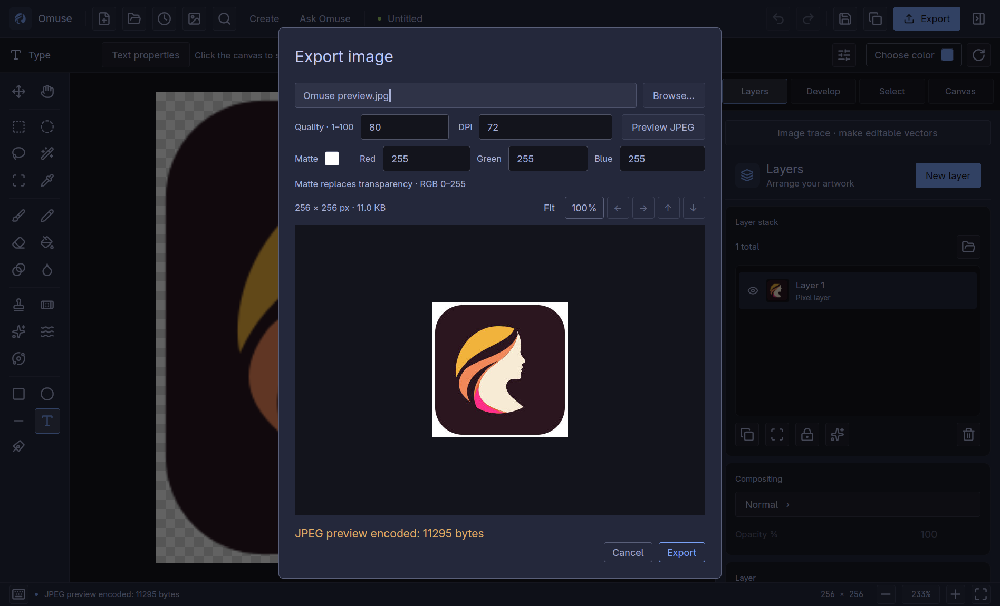
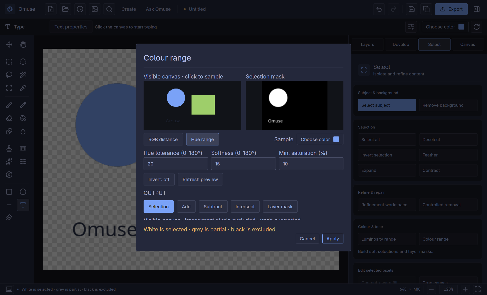

# Omuse 0.8.0 — interface gallery

Actual Linux candidate captures using isolated synthetic artwork. The app
follows gpui-omarchy in light and dark themes. These are full-size XWayland
window captures; no live AI request or personal artwork was used.

[Release notes](v0.8.0.md) · [Photo and vector guide](../user-guide/photo-vector.md)

## Editable text on a curve

Type, guide curves and photo layers stay on the same canvas. Use the Layers
inspector to update the text, then Done to keep the artwork session.

## Inspect the encoded JPEG

Fit and 100% views show the encoded output. Inspect detail before choosing the
quality and matte settings for export.

## Select by hue with a soft edge

Adjust hue tolerance, softness and minimum saturation, then create or combine
a selection or replace a layer mask. The dialog body scrolls independently of
the fixed Apply/Cancel footer.

## Capture scope

Curved text and JPEG were captured from candidate
[`b47ba4d`](https://github.com/Sugata-Software/Omuse/commit/b47ba4d43ed7c326ea0d493f07e61efd14bf70d0).
Hue range was captured from the installed candidate
[`eb558dc`](https://github.com/Sugata-Software/Omuse/commit/eb558dc59ccdf88a3d62dfc2d706a6b836da1eda).
Their Rust source trees are identical; the later revision changes the dependency
test helper and CI wiring. Each captured native synthetic journey passed.
These images do not qualify compact windows, Windows desktops or other hardware.
