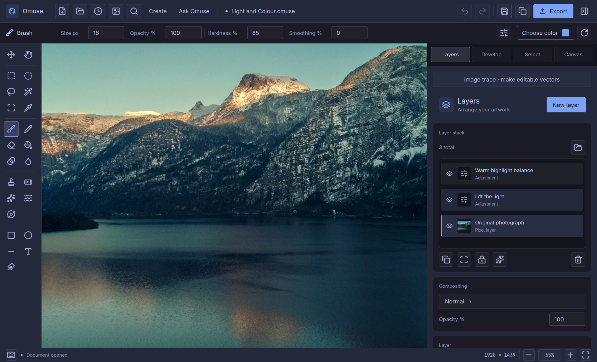
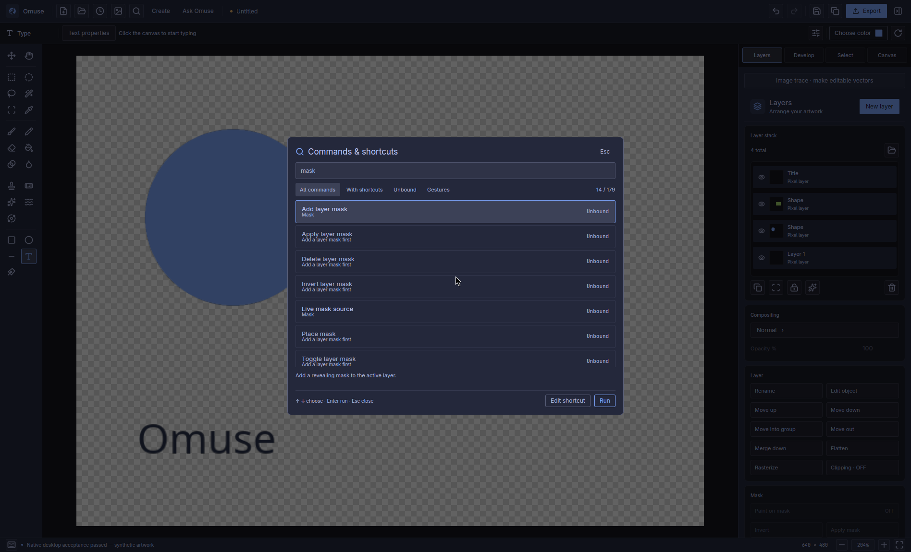

# Omuse user manual

**Make, retouch and finish images on Linux.** This manual describes the Omuse
0.8.0 source pre-release for Arch/Omarchy x86_64, including reference colour
matching, soft hue masks, richer vector artwork and text on curves, alongside
local Image Trace, Create and optional AI workflows. Windows packages remain
unsigned experimental previews with separate desktop and live AI limits.
Start with a photo, keep an editable project, and export a copy when it is ready.

[Install Omuse](../install.md) · [Remove objects](remove-objects.md) ·
[Edit a photo](photo-editing.md) · [Create social content](create-content.md) ·
[Ask Omuse](../ai-experience.md) · [All shortcuts](../keyboard-shortcuts.md)

Prefer a quick overview? [Watch the two-minute 0.7.0 studio film](../media/omuse-0.7.0-studio-film.md),
then follow the illustrated workflows below.

*Tools sit on the left, the selected tool's settings run across the top, and
Layers on the right keeps the original photograph and its adjustments separate.
This dark theme is one example; the workspace follows your Omarchy theme.
[Photograph credit](../media/README.md#previous-photo-editor-capture-and-photograph-credit).*

## Your first edit

1. Launch **Omuse**. Press **Ctrl+O** and open a photo.
2. Press **Ctrl+Shift+S** and save an **`.omuse` project** in your work folder.
   Saving preserves editable layers; exporting produces a finished image.
3. Select the photo layer in **Layers**. Press **Ctrl+J** to duplicate it before
   using a tool that changes pixels. Keep the original underneath.
4. Press **Ctrl+0** to fit the canvas. Press **Ctrl+1** to inspect detail at
   actual pixels. Hold **Space** and drag to pan.
5. Make your edit. **Ctrl+Z** undoes it; **Ctrl+Shift+Z** redoes it.
6. Save with **Ctrl+S**, then export with **Ctrl+Alt+Shift+S**. Open the exported
   file and check the result before sharing it.

If the cursor is inside a text field, keys edit that field. Finish or leave the
field before using canvas shortcuts. **Fit** and **Undo** are also on-screen
controls. Omarchy's system shortcuts and customised Omuse bindings can differ
from the defaults shown here.

## Find a tool without hunting through menus

Press **Ctrl+K**, type a command such as **Content-aware fill**, and press
**Enter** to run the highlighted result. This includes commands without a
keyboard shortcut. **Ctrl+Alt+K** opens the shortcut editor.

The left dock selects tools. The options bar changes with the selected tool.
The right inspector contains **Layers**, **Develop**, **Select** and **Canvas**,
with **Ask Omuse** available for AI tasks. **F7** hides or shows the inspector. **Create** opens the collection
workspace for pages, templates, brand assets and content exports.

*Use Ctrl+K to search commands, tools and shortcuts; select a result with the
arrow keys and press Enter.*

For a visual tour, see [drawing and tracing](photo-vector.md),
[Create workflows](create-content.md), [photo editing](photo-editing.md) and
[complete shortcut reference](../keyboard-shortcuts.md).

## Choose a workflow

| What you want to do | Start here |
| --- | --- |
| Remove a blemish, wire, distracting item or person | [Object removal: local and AI](remove-objects.md) |
| Copy editable groups or layers into another document | [Layer clipboard](photo-editing.md#copy-editable-artwork-between-documents) |
| Crop, resize, improve tone or sharpen | [Photo editing](photo-editing.md) |
| Cut out a product or replace its background | [Backgrounds and cutouts](photo-editing.md#cut-out-a-subject-or-change-the-background) |
| Make a branded post, carousel or small campaign | [Create social content](create-content.md) |
| Add editable type, a logo or a call to action | [Text and layout](create-content.md#add-text-a-logo-and-a-call-to-action) |
| Generate an image or ask for a reviewed edit | [Ask Omuse](../ai-experience.md) |
| Animate pages, add audio/subtitles and export an MP4 | [Motion](create-content.md#make-a-short-animation) |
| Work with RAW, 16-bit sources, filter stacks or masks | [Advanced workflows](../rust-advanced-workflows.md) |
| Trace images, edit vector points, or target a photo colour | [Draw, trace and refine artwork](photo-vector.md) |

## Save projects; export deliverables

Save both a single canvas and a Create collection as an **`.omuse` project**.
Projects are directory packages, so keep the whole directory when copying or
backing up artwork. Omuse recognizes a single canvas from `manifest.json` and
a collection from `project.json`; a collection also keeps its pages and
resources inside the package. An exported PNG/JPEG does not replace that
editable project. Use **Save As** for an independent working copy.

Existing **`.comp`** projects still open. Their first **Save** offers an
**`.omuse` copy** and keeps the original intact.

Saving an older version 1 collection upgrades it to version 2, which stores
nested pages and components as `.omuse` packages. Omuse 0.4.0 and earlier cannot
read version 2 collections. Use **Save As** to a new location if you need an
original copy that still opens in an earlier release.

Use PNG for transparency and sharp graphics; JPEG for opaque photographs;
WebP when your destination accepts it. Create's **Export content pack…** can
produce ordered pages, a multi-page PDF, captions, alt text and a manifest.
Keep a project copy even after export. Recovery is a fallback, not a backup.

## Recent projects and changed files

Click the **Open recent projects** clock icon, or press **Ctrl+Alt+O**, to search the last ten saved/opened
canvases and collections. Type part of a name or folder, use the arrow keys,
then **Enter**. Missing entries disappear when history refreshes. **Clear
history** removes the list, not your projects.

When another program changes an open project, an idle clean document reloads
after two matching checks. Unsaved work stays in place with a **Review** notice:
choose **Keep editing**, **Save a copy**, or explicitly discard local edits and
reload. A conflicting ordinary Save never overwrites the other version.
Repeated **Ctrl+S** queues the newest edits behind a save already in progress.

Ordinary canvases and collection pages use **format 10**. Flat legacy vector
scenes use **11**, grouped scenes **12**, gradients and advanced strokes **13**,
and editable text on curves **14**. **Omuse 0.7.0 cannot read formats 12–14 or
the new reference-colour recipe.** Omuse 0.6.0 also cannot read format 11 or
Target Colour Uniformity. Use **Save As** to keep an older original before adding
new features. Removing a feature or reinstalling an older app does not
automatically downgrade the file.

## AI is optional

Local editing, healing, selection, saving and export work without an AI
subscription. **Ask Omuse → Connections** shows the installed official runtimes,
separate Assistant and Images routes, and their available operations. Provider
sign-in stays with that provider. A subscription request may use its allowance;
Omuse does not silently switch it to a separately billed API.

For ChatGPT via Codex, **Signed in** means the connection is ready. An
**Assistant · not tested** or **Images · not tested** label marks an operation
awaiting its first explicit request; no separate login or test button is needed.
To try image generation, choose **Generate image**, write the brief, select
**Generate image**, review the proposal, then select **Keep result**.

Choose **Auto** or a named provider for each task. You can use **Claude Code**
for **Design & layout** and **ChatGPT via Codex** for image generation, edits,
**Enhance photo** and **Caption & alt text**. Claude currently accepts text and
layout context, while the latter tasks require image input. Connections also
lets you set preferred Assistant and Images roles and exclude a provider from
Auto. A pinned task never silently changes provider after a failure.

For an image or image-edit task, optional follow-on steps can add editable
layout and a caption/alt-text draft. Check the displayed requests and providers
before starting; the sequence uses at most three subscription requests and
presents one final review. **Keep** is one undoable artwork change. See the
[provider and workflow guide](../ai-provider-routing.md).

**Unverified** means Omuse could not prove the discovered runtime's identity.
**Sign in needed** means its identity passed but its provider account is not
available. Sign in through the official provider runtime if needed, then select
**Refresh** in Connections. Omuse 0.7.0 includes the Omarchy fix where recognized
mise-managed Codex or Claude shims could appear as **Unverified** despite an
existing login. Update with the install command if you still use 0.3.0.
Unrecognized wrappers are still refused. Discovery uses the official runtime's
existing login without copying a password or API key. Omuse does not fall back
to a separately billed Claude API. One bounded Claude Design journey passed
Review, Keep, Undo and Redo on the preceding connection-fix candidate. See the
[bounded Claude qualification](../ai-claude-qualification.md) for the exact
local candidate and remaining limits.

Read the request-context card before submitting: image edits share a canvas
image and edit mask. **Local-only** stops new remote requests for the collection.
See [AI connection and review instructions](../ai-experience.md). Availability
is specific to the provider, runtime and operation; another service's chat
subscription does not automatically provide image editing.

## When something seems wrong

| Symptom | What to check |
| --- | --- |
| Brush or removal does nothing | Select an unlocked pixel layer, check its parent group lock, and turn mask painting off if you meant to edit pixels. An editable/RAW source may need a deliberately rasterized duplicate. |
| Only a tiny part changes | A selection may still be active. Use **Ctrl+D** when the next operation should affect the whole layer. |
| A shortcut types into a field | Leave the field, then use the command; or click the visible toolbar control. |
| AI Preview is unavailable | Choose an Images route, review Connections, turn Local-only off only if you intend to send, and make the selection required by that task. |
| A saved AI result cannot be kept | Its source artwork or session changed. Review it, then use **Refine this result** for the current source. Omuse does not overwrite newer work with a stale result. |
| A local operation reports a size/work limit | Work on a smaller copy, a smaller selection or smaller strokes. [Removal limits](remove-objects.md#limits-and-quality-checks) explain the relevant ceilings. |
| A preview looks different from export | Check layer visibility, masks, output format and colour/precision settings. Inspect the exported file at actual pixels. [Advanced colour limits](../rust-advanced-workflows.md#3-precision-and-colour) apply. |
| An update misbehaves | Save your work, use the [rollback instructions](../install.md#update-rollback-and-remove), then reopen Omuse. |

For a reproducible problem, [file a bug](https://github.com/Sugata-Software/Omuse/issues/new/choose)
with the Omuse version, Linux/session details, exact steps and expected result.
Use a non-sensitive example file. The [project dashboard source](../project-guide.md)
and [release notes](../releases/README.md) distinguish supported workflows from
work still being qualified.
