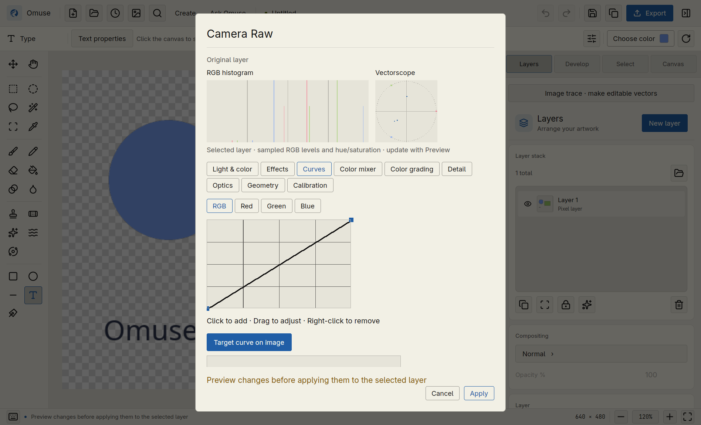

# Edit and finish a photo

[User manual](README.md) · [Remove objects](remove-objects.md) · [Social content](create-content.md)

## Open, protect and inspect

Use **Ctrl+O** to open a photo, then **Ctrl+Shift+S** to save an editable `.omuse`
project.
Use **Ctrl+J** to duplicate the selected photo before direct pixel retouch.
Check the layer is unlocked, including its parent group. **Ctrl+0** fits the
canvas; **Ctrl+1** shows actual pixels; hold **Space** and drag to pan.
**Ctrl++ / Ctrl+-** use fixed zoom steps around the centre of your view. Scroll
over a detail to zoom around the pointer. **Ctrl+0** recentres the whole canvas.

For RAW or 16-bit work, keep the retained source. Rasterizing a copy permits
ordinary pixel painting but gives up that copy's original precision/editing
model. [Advanced workflows](../rust-advanced-workflows.md) explains these limits.

For development builds, see the [upcoming 0.9 workflow preview](upcoming-0.9.md)
for configurable grid snapping, mask inspection, safe folder ungrouping and
native-resolution retouch. These additions are not included in the published
0.8.0 controls.

## Import Photoshop or SVG artwork

**Open** (**Ctrl+O**) accepts Photoshop `.psd` and `.psb` files. Supported files
use **8-bit RGB** colour. Omuse imports layers, supported groups, opacity,
blend modes and masks, and shows an **Import report** for conversions. Save the
result as `.omuse`; the Photoshop original stays unchanged. PSB support uses
the same practical limits as PSD: **512 MiB per file**, **30,000 pixels per
side**, and **100 million decoded pixels across layer and mask surfaces**.
Layers partly outside the canvas keep their original pixels and placement.
Oversized artwork is refused with an explanation instead of being cropped.

Simple horizontal Photoshop text with a uniform style becomes editable.
Its original cached appearance stays visible until you edit it. Select the
text layer and use **Layer actions → Edit text** or search **Edit text or shape**
with **Ctrl+K**. After editing, Omuse lays out the text with its own font engine;
install the original font for the closest result. Warped, rotated, mixed-style,
paragraph-box or otherwise unsupported Photoshop text stays as its cached
pixel layer, with the reason in the report. Imported Photoshop effects may also
be baked into cached pixels. CMYK, 16/32-bit Photoshop files and embedded ICC
profiles are currently refused; export an untagged 8-bit RGB copy from the
source application when appropriate, keeping the original.

**Open** or **Import image** also accepts `.svg` and compressed `.svgz` artwork.
Choose a width in the **Import SVG** dialog; height follows the aspect ratio.
Use **Original**, **2×**, **4×** or **2048 px**, then check the displayed output
dimensions before **Apply**. Large originals receive a visible size suggestion
that you can change. The vector drawing is rendered directly at the chosen
size, so use a larger output when you need more detail. The result is one raster
layer; paths and text are not editable vectors. Save a `.omuse` copy and retain
the SVG original for future resizing.

SVG input is limited to **16 MiB** before and after decompression, and its
output to **25 megapixels** and **30,000 pixels per side**. External images,
fonts, scripts and animations are not fetched or executed. Embed bitmap images
as data or export a self-contained SVG first. Unsupported links or excessive
complexity produce an import error instead of silently omitting artwork.

## Crop and resize

**Crop:** press **C** to preview a crop. An existing pixel selection supplies
the starting bounds; otherwise the frame starts at the full canvas. Choose
**Free**, **Original**, **1:1**, **4:5**, **3:4**, **3:2** or **16:9** in the top bar.
**Swap** changes portrait/landscape orientation, including **9:16** for stories.
Drag a corner to resize or inside the frame to move it. Arrow keys move one
pixel; **Shift+Arrow** moves ten. Space-drag and middle-drag still pan the view.

Choose **Apply** or press **Enter** when the composition looks right. **Cancel**
or **Escape** leaves the artwork and selection unchanged. Outside pixels are
retained in their original layers; **Ctrl+Z** restores the previous canvas.
Cropping changes the canvas bounds, not the resolution of the underlying photo.

**Resize the image:** use **Ctrl+Alt+I** (**Resize image**) to change the image
and content dimensions. Use this for a smaller deliverable. Inspect fine text
and detail after reducing it.

**Change canvas space:** use **Ctrl+Alt+C** (**Resize canvas**) to change the
bounds without scaling the artwork. To invent content in new space instead,
use **Ask Omuse → Expand canvas**, set the extra pixels for each edge, describe
what should continue, and review before keeping it. Expand can refuse a document
whose live blur/noise adjustment would change the original pixels after growth;
it does not flatten those adjustments automatically.

## Precise values without extra clicks

Drag a numeric label left/right to adjust its value. Hold **Shift** during the
drag for finer movement; press **Escape** to restore its starting value.
Double-click the label to reset. You can also type an exact value, press Enter,
or use Up/Down inside the field. Layer opacity previews while dragging and
adds one Undo step when released. Tool settings change the tool, not artwork.

## Dither and finishing effects

Select an unlocked raster layer, then use **Ctrl+K** to find **Dither & halftone**,
**Bloom into transparency**, **Vignette overlay** or **Local tonal contrast**. Dither includes
Atkinson and Floyd–Steinberg diffusion, Bayer 2/4/8, halftone dots/lines/diamonds,
patterns and ASCII. Choose a style, pixel size and colours, then inspect the
preview. **Apply** uses the computed full-resolution result and is one Undo;
**Cancel** leaves the artwork intact. A selection limits the effect. Dither
preserves the existing alpha channel.

Bloom Glow spreads highlights into existing transparent layer margins without
resizing the layer, and shapes their colour.
Vignette Overlay can
also create a vignette on an empty layer. Local Contrast adjusts spatial detail.
These finishing tools support 8-bit copies with canvases/layers up to 16 MP.
For retained RAW/16-bit work, duplicate and convert a copy to ordinary pixels
first. Keep the original source layer.

## Extend a painted mask

Select the layer's mask and paint, fill or draw a gradient beyond its original
bitmap bounds. Omuse grows coverage while preserving the image and mask
placement. White reveals and black hides; the previous reveal/hide background
stays stable when border pixels change. Brush strokes and applied gradients are
one Undo step. Expansion beyond the 16 MP interactive mask budget is refused
with the pre-edit artwork restored.

## Copy editable artwork between documents

1. Press **Ctrl+D** to clear a pixel selection. Select a layer, several layers,
   or a group in **Layers**.
2. Press **Ctrl+C**. Groups, live type/shapes, masks, filters, transforms and
   retained precision stay editable. **Ctrl+X** also removes the selected roots
   if they are unlocked and have no external mask dependents.
3. Open or create the destination document in the same running Omuse session
   and press **Ctrl+V**. The copied roots appear above the active root branch,
   with their stored layer coordinates. Copy the parent group too when its
   transform, mask, opacity or blending contributes to the result; an isolated
   child does not carry its unselected ancestors. Each paste has fresh layer identities
   and is one **Ctrl+Z** step. Copying locked artwork preserves its locks.

With an active pixel selection, **Ctrl+C** copies the selected layer's rendered
appearance instead, including its opacity and mask. **Ctrl+X** refuses pixel
cuts that could discard source content hidden by a mask, visibility, opacity or
other appearance settings, and preserves the existing clipboard. Clear the
selection and copy/cut the complete editable layer instead. To work on a
rendered pixel copy, use **Copy → Paste** and keep the original layer as a backup.
Locked layers cannot be cut.
**Ctrl+Shift+C** always copies the visible composite. Other applications receive
PNG; editable structure is retained only while this Omuse process owns the
matching clipboard. Separate Omuse processes, clipboard managers and app
restarts do not transport editable trees. A changed external image cannot
silently reuse an older group or mask.

Select live mask sources together with their dependent layers. If a dependency
is missing, Omuse explains the problem instead of attaching to an unrelated
destination layer. Whole-layer copying is capped at **256 MiB** of retained
content and a **16 MP source canvas** for its full-resolution PNG. A refusal
leaves the clipboard and artwork unchanged. For larger work, save/open an
editable project or use Duplicate within the current document.

## Improve tone and colour

For a quick pixel adjustment on a duplicate:

| Adjustment | Default shortcut |
| --- | --- |
| Levels | Ctrl+L |
| Curves | Ctrl+M |
| Hue and saturation | Ctrl+U |
| Colour balance | Ctrl+B |
| Camera Raw controls | Ctrl+Shift+A |

Preview the settings before Apply. The ordinary Levels, Curves, Hue/Saturation
and Colour Balance commands change pixels; Undo restores them. For a retained
source and reorderable effects, search **Filter stack** with **Ctrl+K**, add the
needed effects, preview, and Apply. Reopen the stack to adjust its recipe.

### Sample and adjust in Camera Raw

Open **Camera Raw** with **Ctrl+Shift+A** on an unlocked ordinary pixel layer.
The settings remain a draft until **Apply**; **Cancel** keeps the original.

*Use the Light & color, Curves, Color mixer and Optics controls shown here to
sample a tone or colour, then adjust the draft before applying it.*

- In **Light & color**, choose **Pick neutral white balance**, wait for the sampling
  preview, then click a neutral midtone. Avoid clipped highlights, deep shadows
  and transparent areas. Temperature and tint update together; the app reports
  when the correction reaches their supported limits.
- In **Curves**, choose **Target curve on image**, select the RGB or individual
  channel, and drag a tone vertically to adjust its curve. The graph remains
  available for precise point editing.
- In **Color mixer**, choose **Target hue**, **Target saturation** or **Target
  luminance**, then drag a coloured area vertically. **Pick point colour**
  remains available for a more isolated colour adjustment.
- In **Optics**, choose **Pick green or purple fringe** and click that fringe.
  Refine its hue range and amount with the numeric controls.

Release a targeted drag to update the preview. **Escape** during the drag
restores its starting settings; **Cancel** closes the entire draft. Sampling
uses the relevant stage of the current grade, so earlier corrections remain
accounted for. Transparent samples are rejected. Apply commits one Undo step.
In 0.8.0, **Ctrl+Z** undoes the applied result immediately;
**Ctrl+Shift+Z** restores it without first clicking the canvas.
Preview work is limited to one active job and the newest queued request, with
cancellation and checks against changed artwork. Grading still runs at full
resolution within the 16 MP limit; it is not a sensor-RAW or HDR sampling tool.

For an assisted edit, select an ordinary photo layer, open **Ask Omuse → Enhance
photo**, and describe the tonal result. For example: “Lift the exposure slightly,
keep the highlights gentle, and reduce the saturation a little.” Review the
proposed changes and Before/After, then **Keep result**. This task creates native
editable adjustment layers. It affects the whole active layer, not a selected
patch, and currently controls exposure, brightness, contrast and saturation.

## Remove distractions

Use **J** for a small spot, **Content-aware fill** for a selection, or **Ask Omuse →
Remove object** for a reviewed AI fill. Follow the [object removal tutorial](remove-objects.md)
for sampling controls, protected areas, shadows and cleanup.

## Cut out a subject or change the background

### Transparent cutout on this computer

1. Select the photo layer and choose **Select → Remove background**, or find
   **Remove background** with **Ctrl+K**.
2. The local model opens **Refine subject matte**. Adjust Edge refinement,
   Contrast and Edge shift if needed, choose **Preview**, then **Apply**.
   **Cancel** leaves the document unchanged.
3. The result is an **editable layer mask**: original photo pixels remain in
   the layer. Inspect hair, glass, fur, narrow gaps and any background fragments
   the model retained. In 0.8.0, **Ctrl+Z / Ctrl+Shift+Z** work
   immediately after Apply.
4. For painted corrections, start from the original photo, use **Select
   subject**, then **Refinement workspace** from command search. Paint
   foreground/background corrections and compare on black, white or
   checkerboard. This separate refinement workflow creates a result layer and
   preserves the original; hide an opaque original/background layer to see
   transparency.
5. Export **PNG** (or another format that supports alpha). JPEG cannot preserve
   a transparent background.

The full installer supplies the local subject model. A core-only installation
may need the runtime assets before automatic subject selection is available.

### New scene around a product with AI

1. Select the **subject to keep**. This is the opposite of object removal,
   where you select the unwanted object.
2. Open **Ask Omuse → New background**. Describe the new setting, light and mood.
3. Review the Images connection and request context, then **Preview background**.
4. Compare the result and inspect the subject boundary before **Keep result**.
5. For optional local presentation, open **Product finishing**, choose a **Soft**
   or **Contact** shadow and optionally a **Subtle** reflection. Keep the subject
   selected, then choose **Apply local finishing**. **Remove local finishing**
   removes these Omuse-created layers; Undo restores either action.

Local finishing settings are not sent to the provider. An AI background is a
new image composite; keep your editable project and original layers.

## Finish and export

Use **Create → Assets** for local restoration if needed: choose denoise/sharpen
settings and 1×, 2× or 4× pixels, then **Preview restoration** and **Keep restoration**.
Enlargement interpolates pixels; it does not recover detail that was never captured.

Save the `.omuse` project, then **Ctrl+Alt+Shift+S** to export. Check the exported
file's dimensions, edges, transparency and colour at its intended viewing size. For
16-bit PNG/TIFF use **Precision & colour**, review its supported layer types,
and keep an editable project alongside the output.
