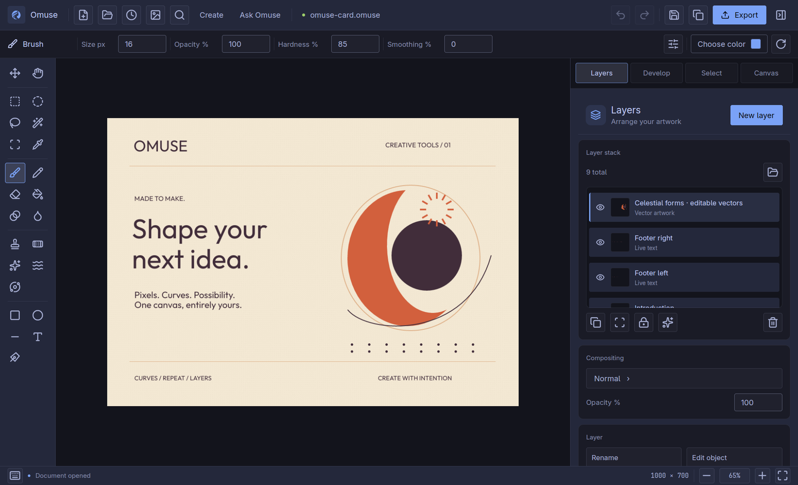
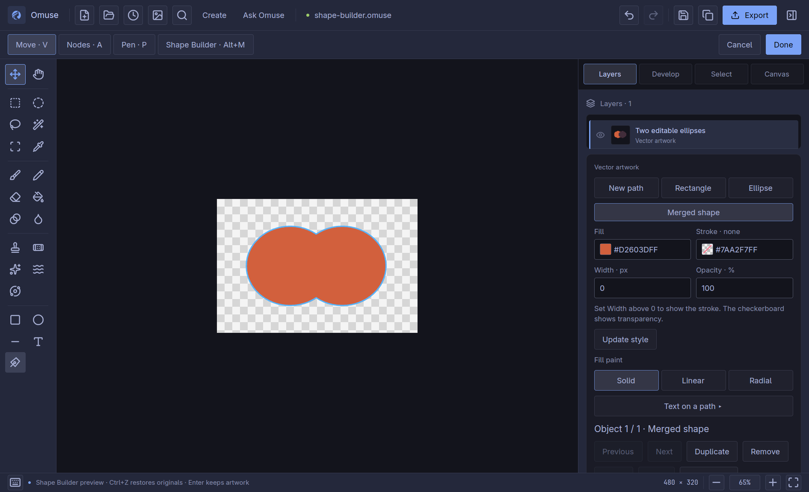

# Shape your next idea — Omuse 0.10 guide

Build and refine artwork on the usual canvas, then exchange a copy when it is
ready. These workflows are included in Omuse 0.10. Keep your `.omuse` master
and inspect previews before exporting. The release qualification separates
tested workflows from remaining platform, interoperability and photo-quality work.

[User manual](README.md) · [Release notes](../releases/v0.10.0.md) ·
[Qualification and limits](../release-0100-qualification.md)

*Actual packaged Omuse 0.10.0 on Linux/Omarchy, source `920ae0fd`. The text,
curves and repeat copies remain editable. This is an unchanged native capture;
[screenshot provenance](../releases/images/v0.10.0/README.md).*

## Build and refine shapes

Open vector artwork with **Shift+P** and use **V** to select objects. The new
path finishing controls live in the same Layers inspector.

- **Simplify** reduces unnecessary points using the tolerance in source pixels.
  Lower values follow the existing contour more closely. Curved fitting is an
  approximation; inspect small details and holes before keeping it.
- **Offset path** expands a filled contour with a positive distance and shrinks
  it with a negative distance. A sufficiently large inset may remove a shape.
- **Outline strokes** turns supported strokes into editable filled outlines.
  An existing fill remains a separate object. Translucent combined fill/stroke
  objects are refused where splitting them would change appearance.
- **Unite, Subtract, Intersect, Exclude and Divide** now operate on Bézier
  geometry rather than flattening every curve into polygon nodes. Intersections
  can still introduce new nodes; Undo restores the original geometry exactly.

Choose **A**, select a node, and use **Split path at selected node** in **Ctrl+K**
to cut an interior node or open a closed contour. **Join nearest path endpoints**
connects a selected endpoint to the nearest open endpoint within that object.
It does not join different objects. Convert retained text to outlines before
editing glyph nodes.

## Snap nodes and handles precisely

On the main canvas, enable **Toggle snapping** through **Ctrl+K**, then drag a
node or Bézier handle. Targets within **6 screen pixels** snap to other visible
anchors in the same vector artwork, or to visible guides and grid lines. A
nearby anchor takes priority as a complete point; guides and grid lines can
snap each axis separately. The canvas marks the snapped position. Layer scale
and rotation are accounted for before measuring the screen distance.

Hold **Shift** to bypass snapping while retaining the existing **45-degree
angle constraint**. Alt's independent-handle behavior is unchanged. This applies
to node and handle drags, including Pen drag handles; initial Pen clicks,
whole-object moves and the legacy path dialog keep their existing behavior.

Targets are cached once per drag. If the artwork or a dense neighborhood exceeds
the snapping work limit, that drag continues unsnapped with a status message.
Release and start another drag to rebuild the targets. These controls were
added in 0.10; earlier releases retain their previous snapping behavior.

## Drag through Shape Builder regions

1. Select **2–8 consecutive paths** in the object stack. They must be visible,
   fully opaque fills without strokes. Opaque gradient fills are supported.
2. Press **Alt+M**, or search **Shape Builder** with **Ctrl+K**. The canvas shows
   the available region outlines.
3. Drag through regions to merge them. Hold **Alt when starting the drag** to
   erase those regions instead. Fast drags also include regions crossed between
   mouse events, including the final segment to the position where you release
   the mouse. Holes remain empty.
4. Release to prepare one editable result. **Ctrl+Z** restores the originals;
   **Ctrl+Shift+Z** restores the result. Start Shape Builder again for another
   gesture. **Enter/Done** keeps the whole artwork session as one document edit.

*Two original ellipses become one editable Merged shape in packaged Omuse
0.10.0. Draft Undo restores both originals; [capture details](../releases/images/v0.10.0/README.md).*

A merge uses the first chosen region's paint. Unchanged regions retain the
visible topmost source paint. Nonconsecutive selections are refused to preserve
interleaved artwork order. Complex input can exceed the bounded geometry work
budget; select fewer paths or simplify first. Escape discards the artwork draft.

## Exchange SVG artwork

Omuse 0.10 additionally converts supported SVG text/tspan content
to editable glyph outlines, reporting font substitution and outline conversion.
Supported gradient strokes and skewed/nonuniform solid strokes expand into
filled outlines, with a conversion warning. Single-painted-child group opacity
can be represented; general isolated group compositing, clipping, filters,
pattern paints and external resources remain outside the editable subset.
Keep the original SVG when editable text or unsupported semantics matter.

## Repeat an editable motif

Select the motif objects first. In the Layers inspector, set columns, rows
and steps for **Preview grid**, or
count, angle and centre for **Preview radial**. The same actions appear in
**Ctrl+K** as **Repeat vector grid** and **Repeat vectors radially**. Counts
include the original motif; grid distances and radial centres use source pixels.
Radial copies can rotate with the angle or keep their orientation. Originals
retain their positions in the object stack, and generated copies are appended
above existing artwork. Curves, paint and text remain editable in each copy.

A motif can contain **1–64 selected objects**, with at most **256 instances**
including the original. The complete artwork is limited to **1,024 objects**
and **100,000 anchors**; large text or geometry can hit a work limit sooner.
Start with a small grid and increase it after inspecting the result.

The accepted result is a set of independent editable copies. The saved project
does not retain a live repeat recipe linking them to the source. Use **Ctrl+Z**
before changing the repeat settings and generating a different arrangement;
**Enter/Done** keeps the artwork session. Persistent live repeats, patterns,
blends, variable-width strokes, mesh/envelope tools and linked paragraph flow
remain on the roadmap.

## Photo removal and PSD exchange

**Controlled removal** adds an opt-in **Texture · experimental** method.
**Context** remains the default. Follow the [photo workflow](photo-editing.md)
and [qualification record](../texture-removal-qualification.md); real photo
results include both useful repairs and visible seams.

Layered PSD export and 16-bit composite import are described in
[Photoshop exchange](../psd-exchange.md). These are explicit conversion paths;
`.omuse` remains the editable master.

After exporting a layered PSD, search **Export conversion report** with
**Ctrl+K** to view its destination filename and conversion notes. This report describes
the last layered PSD exported in the current editor session, including content
baked into pixels. It is separate from **Import conversion report** and is not a
saved, cross-session export history.

## Keep a compatible original

`.omuse` keeps the editable source. The new geometry tools and repeat copies
use existing scene formats; a repeated motif is ordinary saved objects, not a
linked effect. This does not guarantee that every older editor can open the
project: grouped artwork, gradients and curved text already need newer formats.

New **Texture** removal and **SmoothV1** tone recipes require a build that
understands their versions. An older build can refuse to open the containing
project. Unversioned tone recipes retain their legacy rendering; existing
removal recipes retain their recorded method. Before backward editing, save a
separate copy and rasterize those editable results in the newer build. Keep
the original for further changes. Ordinary Camera Raw **Apply** produces
raster pixels; reinstalling an older app does not downgrade saved recipes.

Layered PSD export is another conversion: live text, vectors, effects and
retained precision become pixels. Read the **Export conversion report**, keep
the `.omuse` master and inspect the exported file in the receiving application.

## Assistant editing

Assistant plans can reference the bounded object IDs exposed for an editable
vector layer and request the same Simplify, Offset, Outline and boolean commands.
The result remains a proposal to review and Keep, with a single document Undo.
This native command path does not establish fresh live-provider qualification.
Missing objects, locked layers, invalid values and over-budget operations fail
before the source document changes.
