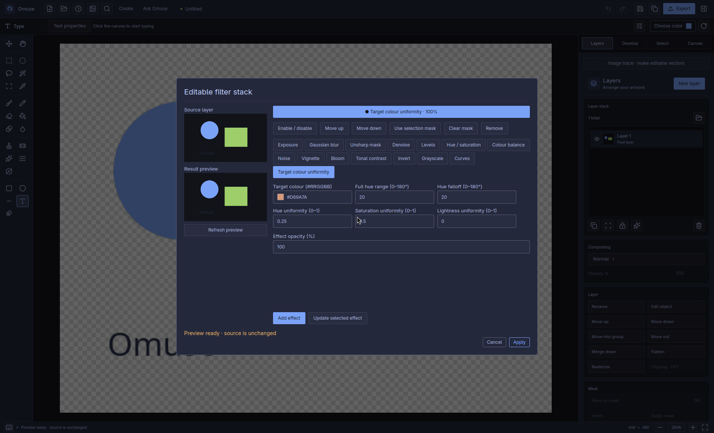
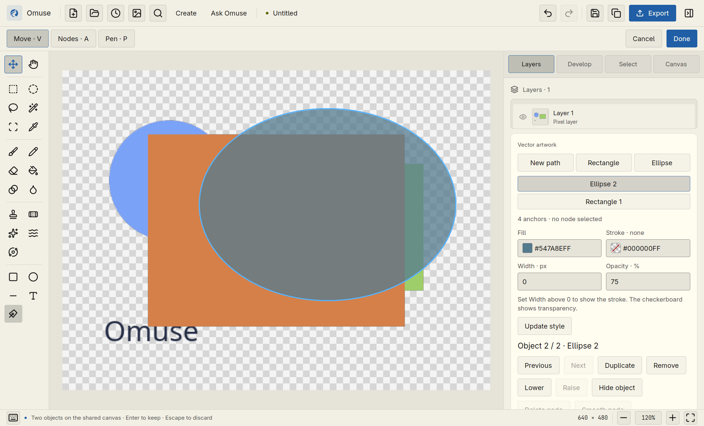
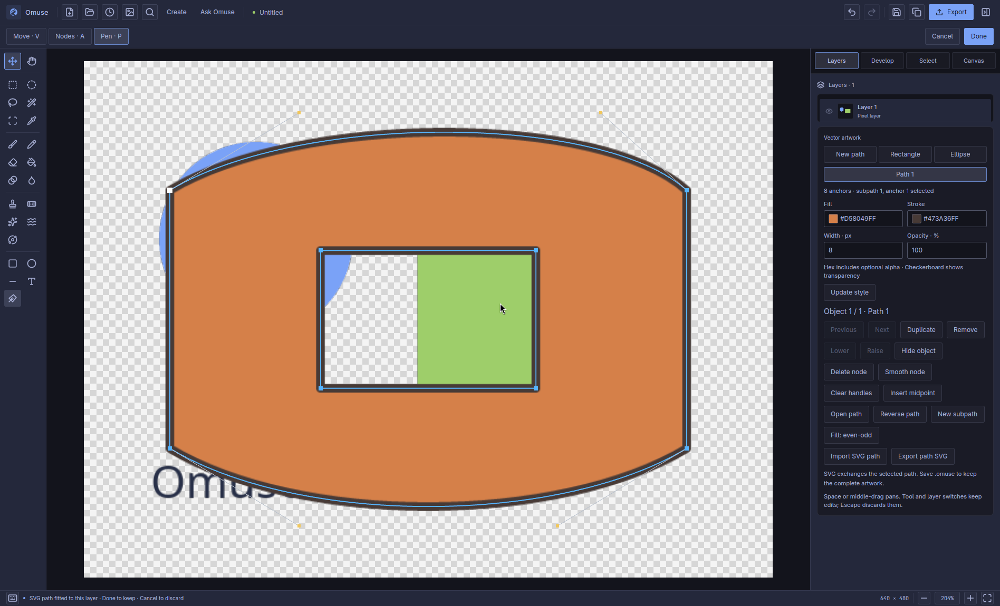
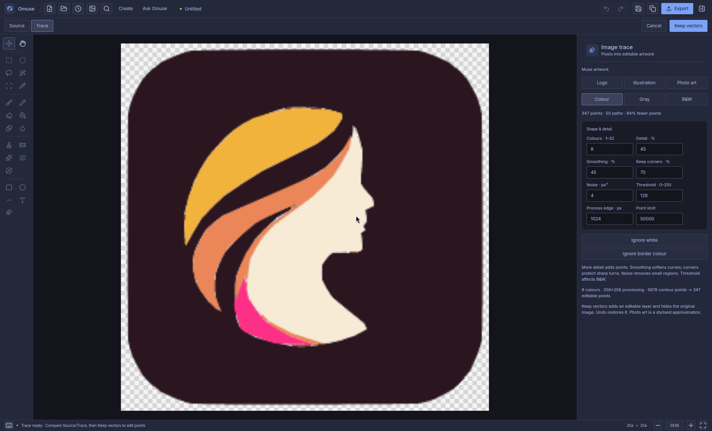

# Draw, trace and refine artwork

**Omuse 0.7.0** keeps photos and editable vector artwork on the same canvas.
Use **P** to draw, **A** to refine points and **V** to move objects. Trace a bitmap
when you want a simpler graphic, or use the colour tools to refine a photo.

[User manual](README.md) · [Photo editing](photo-editing.md) ·
[Create content](create-content.md) · [Current interface gallery](../releases/v0.7.0-gallery.md)

## New photo and vector tools — unreleased development build

These controls extend the 0.7.0 instructions below. They are not part of the
published 0.7.0 source release. Vector tools stay on the same canvas and Layers
inspector; use **Ctrl+K** to find their commands. Instructions here describe the
implemented development build, not a completed public release test run.
See the [development qualification record](../vector-workflow-qualification.md)
for tested scope and remaining release checks.

### Select, group and arrange

1. Open an artwork layer with **Shift+P**, then press **V**. **Shift-click**
   objects to add or remove them from the selection. Drag empty canvas to make
   a marquee; it selects fully enclosed objects. Hold Shift to extend it.
2. **Ctrl+A** selects visible objects; **Ctrl+D** clears the object selection.
   Clicking a group selects its members. **Ctrl-click** selects an individual
   member; double-click opens its points. **A** and **P** work on one active
   object's geometry.
3. Drag or use arrow keys to move the selection. **Shift+Arrow** moves ten
   source pixels. **Ctrl+J** duplicates it. **Ctrl+G** groups; **Ctrl+Shift+G**
   removes the outer group. Groups organize objects and preserve nested groups;
   they do not introduce isolated group opacity or effects.
4. In Move mode (**V**), the inspector's **Move X/Y**, **Scale** and **Rotate** fields apply relative
   movement, uniform percentage scaling and rotation about the selection
   centre. **Ctrl+T** opens and reveals these controls. Choose **Transform selection**
   to apply them. Align controls use the selection bounds; **Space X/Y**
   distributes three or more selected units with equal gaps. Complete groups
   are treated as units.
5. Change a fill, stroke or opacity field to apply that changed property to
   every selected object. Other properties remain as they were. **Same fill**,
   **Same stroke** and **Same opacity** find visible objects matching the active
   object. Stroke matching includes its colour and width.

All these operations participate in draft **Ctrl+Z / Ctrl+Shift+Z**. **Done**
keeps the entire draft as one document Undo step; **Escape** discards it.

### Combine filled shapes

Select at least two closed, filled objects, then use **Unite**, **Subtract**,
**Intersect**, **Exclude** or **Divide** in the inspector or command search.
For text objects, duplicate an editable backup and **Convert to outlines** first.
The bottom selected object supplies the result's fill, stroke and opacity.
Subtract cuts later selected shapes from that bottom object. Divide partitions
that bottom object with each later cutter; cutter-only areas are discarded.
Unselected objects remain in the scene.

The result is editable geometry. Curves are flattened with a 0.05-source-pixel
tolerance, so the operation does not preserve the original Bézier handles.
Undo restores the exact original objects. Open paths and objects without a
fill are refused. Operations have object, point and output budgets; cancellation
discards the draft and a stale result cannot replace newer document work.

### Exchange an SVG artwork

Use **Import SVG artwork** to append supported paths and shapes. The SVG
viewport fits proportionally inside the artwork, keeping empty margins and
centering the imported content. The import selects the new objects and retains
existing artwork. **Export artwork SVG** writes the entire scene to a new
filename; existing files are preserved.

Supported content includes multiple paths/basic shapes, compound fills, solid
or linear/radial gradient fills, object opacity, organizational groups, names,
visibility and supported transforms. Uniform-width strokes retain supported
caps, joins, dashes and offsets; skewed or nonuniformly transformed strokes are
refused. Gradients can use Pad, Repeat or Reflect.

SVG text import, gradient/pattern strokes, clipping, masks, effects, group
opacity and external resources remain unsupported. Omuse's text-on-curve
objects export as glyph outlines, so another editor receives paths rather than
editable text. Keep the `.omuse` file for its text recipe. General SVG raster
import is still available for artwork outside the editable subset.

### Set gradient fills and precise strokes

1. Select an object in **Vector artwork**, then use **Fill paint → Linear** or
   **Radial** in Layers. **Solid** returns to a flat fill.
2. Select a stop by its percentage/swatch. Set **Stop · %** and **Stop colour**
   (`#RRGGBB` or `#RRGGBBAA`), then choose **Apply paint settings**. Use **Add
   stop**, **Remove** or **Reverse**; a gradient has 2–16 ordered stops.
3. Set Start/End for a linear gradient, or Centre/Focus/Radius for a radial
   gradient. Coordinates are local to the artwork object. **Fit gradient to
   shape** supplies a useful starting geometry; a radial focus must stay inside
   its radius. Choose **Pad**, **Repeat** or **Reflect** for the spread.
4. Enable a stroke with a nonzero width. **Stroke geometry** provides
   Butt/Round/Square caps, Miter/Round/Bevel joins, solid/dashed style,
   **Dash, gap · px**, **Dash offset · px** and **Miter limit**. Use up to eight
   dash/gap pairs, or clear the field for a solid stroke. Apply the settings to
   the selected objects.

Use draft Undo to compare, and **Done** to keep the artwork session. Stops can
carry transparency. Variable-width strokes, stroke expansion, live offsets,
mesh gradients and pattern fills are still planned.

### Put editable text on a curve

1. Draw one curve with **P**, then select it with **V**. Open **Text on a path**
   in Layers. Enter a single line, font family, size, tracking and curve position.
2. Choose **Start**, **Centre** or **End** alignment, then **Create text on
   curve**. The original guide stays as a separate editable object. If text
   does not fit, shorten it, reduce size/tracking, adjust its position or extend
   the guide; Omuse refuses a result that would silently omit glyphs.
3. Select the new text object to revise its fields and choose **Update text**.
   **Reverse curve** changes the text direction. Apply pending text fields
   before finishing or leaving the draft.
4. To reshape the guide, select the original curve and use **A** to move/add
   nodes and handles. Then **Shift-select** the curve and its text object and
   choose **Use selected curve for text**. The text updates explicitly; it is
   not a live link that follows every guide drag.
5. For direct glyph-node editing, duplicate the text object if you want an
   editable-text backup, then choose **Convert to outlines**. The resulting
   paths can be edited with **A**; Undo restores the recipe.

The current tool accepts one line of 1–512 characters on one guide of 2–512
anchors, within the overall vector geometry budget. It reports resolved fonts;
missing families may fall back to an installed font or bundled Outfit. Missing
glyphs and unsupported colour/bitmap glyphs are refused. Saved outlines keep
the current appearance when reopening on another machine; editing the text
reshapes it with that machine's available fonts. This does not provide paragraph
flow, styled spans along a curve, or arbitrary SVG text import.

### Export vector artwork as PDF

Open the artwork and choose **Export vector PDF**. For a scene this exports its
vector objects in layer-source coordinates; the legacy path dialog exports its
path. Use a new `.pdf` filename. The page's physical size follows the document
DPI, and existing destination files are preserved.

Supported curves, object transparency and **Pad** gradients remain vector
content. **Repeat** and **Reflect** are refused: switch to Pad or export SVG to
retain their spread. Text uses saved glyph outlines, with no embedded editable
text or font dependency. Surrounding photos, layer placement, layer masks and
effects are not exported by this artwork command. For a complete composition,
use the existing content/page export workflow, whose PDF pages are rasterized.

This bounded export is not PDF/Illustrator import, tagged/selectable-text PDF,
PDF/X, CMYK, spot-colour or overprint support. It caps PDF output at 16 MiB and
page edges at 200 inches; increase document DPI if a page exceeds that size.

### Inspect outlines and zoom

**Ctrl+Y** toggles a geometry-only outline view while editing. It changes the
view, not saved paint or export. Simple photo/vector documents rerender the
editing preview at integer zoom levels up to 4×, with a 16-million-pixel budget.
Large canvases and documents using masks, layer groups, effects or unsupported
metadata retain the ordinary settled preview. This is a bounded editing
preview, not unlimited-resolution zoom or a persistent vector tile renderer.

**Compatibility:** save a separate original before trying new features.

| Artwork retained in the development build | Scene version | Canvas format |
| --- | --- | --- |
| Legacy flat vector objects | 1 | 11 |
| Organizational groups | 2 | 12 |
| Gradients or advanced stroke settings | 3 | 13 |
| Editable text on curves | 4 | 14 |

Other canvases still write format 10. Omuse 0.7.0 cannot read formats 12–14.
Ungrouping, clearing paint or outlining text does not automatically downgrade
an already-upgraded scene. **Save As** preserves an older compatible original;
it does not convert a new project back to an older format.

### Import Photoshop adjustments and external text more safely

Open an 8-bit RGB PSD/PSB and review its **Import report** before saving a new
`.omuse` copy. Levels now reads the stored gamma correctly. Hue/Saturation
separates the master adjustment from Colorize, and the report identifies
selective colour bands or saturation/lightness mapping that can differ from
Photoshop. Imported masks retain whether pixels outside their bitmap are
hidden or revealed. Truncated or invalid records produce an error.

The existing [Photoshop import limits](photo-editing.md#import-photoshop-or-svg-artwork)
still apply, including refusal of embedded ICC profiles and 16/32-bit or CMYK
files. This does not add complete PSD round-trip or mixed-style Photoshop text.

Supported external format-11 projects can also contain UTF-16 font runs alongside
colour runs. Opening converts valid ranges to Omuse text spans without
rerendering the cached image. Font and colour runs can cover the same text;
overlaps within either run type, split Unicode characters, conflicting encodings
and excessive ranges are refused. The next text edit uses local fonts; keep the
original project when font fidelity matters. External text format 11 and native
vector scene version 1 are separate compatibility paths.

### Keep soft masks and select by hue

When making a reveal/hide layer mask from a feathered selection, intermediate
coverage now remains soft, including on fractionally placed or rotated layers.
The mask remains editable and Undo can restore the prior state.

For a colour-specific mask, open **Select → Colour range** and choose **Hue
range**. Click the visible-canvas preview to sample a colour, or choose it in
the picker. Set **Hue tolerance**, **Softness** and **Min. saturation**; increasing
minimum saturation helps exclude neutral greys. Inspect the mask preview and
use **Invert** when needed. Choose **Selection**, **Add**, **Subtract**,
**Intersect** or **Layer mask**, then **Apply**. Layer mask replaces the selected
layer's mask. A neutral grey sample has no hue; sample a coloured pixel instead.

Hue uses circular colour distance, so reds near 0°/360° stay neighbours.
Coverage follows the visible canvas alpha; these are colour-based masks, not
semantic subject recognition. Saved layer masks retain their pixels, not a
reopenable hue-range recipe. The existing 16-million-pixel limit remains.

### Match the palette of a reference image

1. Select an unlocked photo layer, optionally making a selection first. Open
   **Develop → Filter stack → Match reference colour**, or **Precision & colour
   → Match reference colour…**.
2. Choose **Choose reference image…**, or expand **Enter a file path…**, enter
   a reference path and choose **Load path**. The path section opens if the file
   chooser fails. Check the thumbnail and ICC/untagged status. Supported
   references are PNG, JPEG, TIFF, WebP, BMP and GIF's first frame, up to 16 MP
   and 128 MiB. Untagged images use sRGB; invalid profiles are refused.
3. Set **Match amount (%)**. Keep **Preserve lightness** enabled to retain source
   lightness, or switch to **Match reference lightness** for tonal transfer too.
4. Choose **Add effect**, or **Update selected effect** when revising a node.
   Optionally use **Use selection mask**, inspect **Refresh preview**, then
   **Apply** to commit one Undo step. Reopen the stack to adjust the result.

The match transfers global, alpha-weighted Oklab colour statistics from at most
65,536 samples. Similar subjects and framing work best. It does not identify
skin/products, copy local lighting, calibrate cameras or reproduce an HDR look.
Flat channels use a mean shift; variance expansion and gamut mapping are bounded.
Both ordinary 8-bit and retained 16-bit sRGB/Display P3 sources are supported,
without making the whole editor or its display a wide-gamut/HDR pipeline.

The saved effect keeps compact reference statistics, Amount and the lightness
choice, not the reference pixels or path. It therefore remains usable if the
reference file moves, but reopening the node does not restore its thumbnail.
Older releases cannot read this new operation; retain a separate older project.

### Inspect JPEG detail and refine raster strokes

Export to a `.jpg`/`.jpeg` filename, set quality, DPI and matte, then choose
**Preview JPEG**. **Fit** shows the encoded image; **100%** uses one image pixel
per screen pixel. Drag the preview or use its arrow buttons to inspect another
area. Adjusting export settings invalidates the old preview: generate a fresh
one before comparing. Preview is limited to 16 MP and does not alter artwork.

Blur, Smudge and Liquify keep the existing tools and Undo workflow. Their
fractional brush footprints and spacing now follow the stroke path more
consistently: Smudge carries the evolving paint, while Liquify accumulates
displacement and samples the untouched source once per stroke. Duplicate and
rasterize a photo copy for direct retouch if the original holds RAW/16-bit data.
Use shorter strokes with very large brushes when a work budget is reached.
These remain bounded raster tools; they do not replace retained RAW processing
or establish quality on every real photograph.

## Make a product colour more consistent

Target colour uniformity brings nearby hues and saturation closer to a chosen
reference while letting you retain tonal texture. It is a local editing tool;
it does not use an AI account or identify skin, clothing or products for you.

1. Select an unlocked image layer. If other parts of the picture share the same
   colour, make a selection around the area you want to change first.
2. Open **Develop → Filter stack**, or search **uniformity** with **Ctrl+K**.
3. Choose **Target colour uniformity**. Enter the reference as `#RRGGBB`.
4. Set the hue **range** and **falloff** in degrees. Range gives full coverage
   on each side of the reference hue (20° means ±20°); falloff fades the
   adjustment to zero beyond it. Their sum cannot exceed 180°.
5. Set hue, saturation and lightness uniformity independently from **0 to 1**.
   Start with lightness at **0** to retain the source's HSL lightness and texture.
   Grays and near-neutral colours are protected from arbitrary hue changes.
6. **Add effect**, attach **Use selection mask** if wanted, then inspect
   **Refresh preview**. **Apply** commits one Undo step. Reopen the stack and use
   **Update selected effect** to revise it later.

The original pixels, parameters, opacity and node mask remain editable in the
`.omuse` project. The calculation uses encoded-sRGB HSL, including for selected
colours in P3 sources; it is not perceptual luminance matching or a complete
wide-gamut colour-grading engine. Broader photographic quality remains under
evaluation. Target-colour nodes are new: **0.6.0 cannot open a project containing
one**. Use Save As to keep a copy readable by that release.



*The reference swatch shows the target colour. Range and falloff limit the hues
affected; the three strength controls preserve as much variation as you choose.*

## Build several objects in one artwork layer

1. Press **Shift+P** or search **Vector artwork on canvas** with **Ctrl+K**.
   Artwork opens on the main canvas, with its object list and controls in the
   shared **Layers** inspector. There is no separate artwork dialog. Starting
   from a photo or ordinary layer creates a new artwork layer when you finish;
   selecting an existing artwork layer edits that scene.
2. Choose **Rectangle**, **Ellipse** or **New path**. Click an object in
   the inspector list, use **Previous** / **Next**, or press **V** and click its
   visible artwork on the canvas. The list shows the topmost object first.
3. Press **V** to drag an object, **A** to edit its nodes, or **P** to draw a path.
   In Move mode (**V**), double-click an object to edit its nodes. **Alt-drag** moves the selected
   object, including an object with transparent paint that is visible only as
   an editing outline.
4. Set fill/stroke colours as `#RRGGBB` or `#RRGGBBAA`, stroke width in
   layer-source pixels (0–4096), and **Opacity** (0–100%). Valid field
   changes update the preview automatically; **Update style** also applies the
   current fields. Each colour field includes a live swatch; its checkerboard
   shows transparency. Click the swatch or hex value to focus the field.
   A fill alpha of `00` gives no visible fill; stroke width **0** disables the
   stroke and shows **Stroke · none** with a crossed swatch. An incomplete or
   invalid hex value shows a question mark and keeps the last valid artwork.
5. Use **Lower**, **Raise**, **Duplicate**, **Hide object** / **Show object** and
   **Remove** to arrange the artwork. Removing the last object leaves an empty
   path ready for drawing.
6. Press **Enter** with the canvas focused, or choose **Done**, to keep the
   complete edit as one document Undo step. **Escape** or **Cancel** discards
   the draft. Select the artwork layer and press **Shift+P**, **P** or **A** to
   edit it again.

Switching between **P**, **A** and **V** stays within the same draft. Choosing
another editing tool, selecting another layer or saving first keeps the draft,
then continues the requested action. An invalid style field prevents finishing
and leaves the draft open: correct it, or use **Cancel** to discard the edit.

While editing, **Ctrl+Z** and **Ctrl+Shift+Z** undo and redo individual draft
changes without leaving the canvas session. Draft history is bounded to 64
entries and 32 MiB. Once you finish, the entire session becomes one document
Undo step.

Navigation is shared with photo editing: hold **Space** and drag, or drag with
the **middle mouse button**, to pan; **scroll** to zoom around the pointer.
**Shift+scroll** pans. The canvas displays the draft through the normal document
compositor, so its settled preview includes the surrounding photo layers and
the artwork layer's placement, masks, opacity, blend and supported effects.
Node outlines follow interaction while the background preview updates.

All objects share one scene and one display image. This keeps multiple shapes
from each retaining a full-canvas photo-processing source and result. Limits
remain 1,024 objects, 100,000 total anchors, 4,096 subpaths and 16,777,216 source
pixels, with additional rendering-work and document budgets. Complex artwork
can reach a budget before the object count. Previews run in the background and
keep only the newest requested update.

Save as **`.omuse`** to retain objects, styles and their order. In the 0.7.0
baseline shown here, a canvas containing this artwork uses **format 11**, which
**0.6.0 cannot open**. The unreleased features above can require formats 12–14.
Use **Save As** to keep a compatible original. Other canvases still use format
10. **Rasterize** explicitly converts the layer to pixels before painting or
destructive filters; Undo can restore its editable objects. Layer placement,
masks and supported layer effects remain available around the shared artwork.

The scene still uses an 8-bit display cache. The unreleased controls above add
gradients, booleans, text on curves and a supported multi-object SVG subset;
they are absent from the 0.7.0 baseline. Persistent visible-tile caching and
complete SVG interchange remain open. Exporting artwork through the 16-bit
path promotes its existing 8-bit cache; it does not create additional precision.



*Choose an object in the artwork inspector to change its fill, stroke, opacity
or position in the scene. The whole scene stays in one artwork layer.*

## Draw and refine an editable path

Press **P** to draw on the main canvas. On a photo or ordinary layer, this starts
a new artwork layer; you do not need to create a blank layer first. On existing
vector artwork it opens that scene in Pen mode. **A** enters Node mode, and
**V** selects and moves objects. The inspector's path controls affect the
selected object. Zoom in when nearby anchors and handles overlap so you can
pick each one precisely.



*Click or drag with **P** to place corners and smooth Bézier points; switch to
**A** to move anchors and handles in the shared canvas.*

- In **Pen** mode, click to place a sharp corner or **click-drag** to draw a
  smooth point with opposing Bézier handles. Click the first anchor of an open
  contour to close it. Choose **New path** or **New subpath** to start another.
- In **Nodes** mode, drag an anchor to move it together with its handles, or drag
  a handle dot to reshape the curve. Smooth handles stay aligned; hold **Alt**
  while dragging a handle to break that alignment. **Shift** constrains anchor
  movement and handle directions to 45-degree increments.
- In Pen mode, click near a segment to add a point. In Nodes mode,
  **double-click a segment**. The curve is divided exactly at that location,
  so inserting a point does not change its shape.
- **Smooth node** creates handles; **Clear handles** makes a corner. The
  inspector reports the current path's anchor count and selected point.
- **Insert midpoint** divides the segment after the selected anchor while
  preserving its curve. At the end of an open path, it divides the preceding one.
- **Open/Close path** and **Reverse path** act on the selected subpath, or the
  last subpath when no node is selected.
- **New subpath**, followed by Pen-mode clicks, starts another contour.
  **Fill: even-odd** makes overlapping contours into holes. **Fill: non-zero**
  uses their winding direction instead.
- **Arrow keys** nudge the selected anchor and its handles by one layer-source
  pixel; **Shift+Arrow** nudges by ten. With no anchor selected, they move the
  selected object's entire path.
- **Delete node** removes the selected anchor. **Delete** also removes an
  anchor when one is selected; otherwise it removes the selected object.

Geometry and styles remain editable in `.omuse`. **Done** / **Enter** keeps the
whole draft as one document Undo step; **Cancel** / **Escape** discards it.

### Older retained paths and vector masks

Older single-path recipes and vector masks keep their existing retained model;
opening a project does not silently convert them into a multi-object scene.
Select an older retained-path layer and use **Ctrl+K → Edit text, shape or vector
artwork** to edit its existing recipe. These compatibility path/mask dialogs
retain **Apply** / **Cancel**; **P** opens the modern scene workflow instead.
In a legacy path dialog, Apply replaces that layer's artwork with the path;
its checkerboard preview does not show an old photograph beneath it. Retained
effects appear after Apply. **Ctrl+K → Vector mask** opens the mask workflow,
which retains editable geometry and applies it as coverage over the layer's
image.

## Turn an image into editable vector artwork

Select a pixel image layer and choose **Image trace** in **Layers**, or use
**Ctrl+K → Image trace / retrace**. The trace uses the ordinary canvas and right
inspector. It runs locally without an AI provider or subscription.

1. Start with **Logo** for a black silhouette, **Illustration** for flat colour,
   or **Photo art** for a stylised photographic result. You can then switch
   between **Colour**, **Gray** and **B&W**.
2. Use **Source** and **Trace** above the canvas to compare. The document stays
   unchanged during preview. You can zoom, pan and open command search; keep or
   cancel the trace before another edit.
3. Adjust the controls below. New settings replace older pending previews;
   **Keep vectors** becomes available only when the current valid preview is
   ready. An invalid field or budget error keeps the last preview visible and
   explains what needs changing.
4. Choose **Keep vectors**. Omuse adds an editable artwork layer directly above
   the image in the same group, preserves its placement and supported layer
   treatment, and hides the original bitmap. Node editing opens immediately.
   **Cancel** or **Escape** before keeping leaves the document unchanged.
5. Use **V** or the inspector's object list to choose a coloured shape, **A**
   to edit its points, and **P** to add curves. Same-colour regions can share
   one compound object. Finish that editing session before using document Undo:
   keeping the trace is one Undo step, and any subsequent point-edit session is
   another.
6. Save an **`.omuse`** project to retain the source, geometry and trace settings.
   Select the vector layer later and choose **Retrace original image** to revise
   its settings. Retracing replaces manual point edits in that layer; duplicate
   the vector layer first if you want to keep that version. Source and trace
   remain separate layers.

| Control | What it changes |
| --- | --- |
| Colours · 1–32 | Maximum palette size for Colour and Gray. Fewer colours make simpler artwork. |
| Detail · % | Higher values follow the pixel contours more closely; lower values reduce anchors. |
| Smoothing · % | Adds and adjusts Bézier handles instead of retaining only straight segments. |
| Keep corners · % | Higher values protect sharper turns from smoothing. |
| Noise · px² | Merges smaller connected regions into a neighbouring region; measured at processing resolution. |
| Threshold · 0–255 | In B&W, pixels darker than this become black foreground. Lighter pixels are omitted. |
| Process edge · px | Longest processing edge, 16–4096; never enlarges the source. The engine also caps working pixels and estimated work. |
| Point limit | Safety ceiling, 4–100,000 anchors. If exceeded, lower Detail, Colours or Process edge, or increase Noise. It does not silently discard shapes to meet a target. |
| Ignore white | Omits near-white regions in Colour/Gray. |
| Ignore border colour | Omits the dominant border colour when it covers at least half the border. Inspect the result because foreground can share that colour. |

The inspector shows editable points, paths and reduction from the original
pixel contours. Point reduction is a geometry count, not a visual-quality
score. Logos, silhouettes and flat illustrations are the best starting
material. Photo art produces solid-colour shapes, not a lossless photograph,
editable text, gradients or a reconstruction of the original design.
The 0.7.0 canvas preview uses the source image's pixel dimensions; zooming
into a small source can look pixelated even though the retained curves are editable.
The unreleased editing preview above rerenders admitted simple documents up to 4×.

Tracing accepts source layers up to **16,777,216 pixels**. Processing is bounded
at four megapixels, two million raw contour edges, 100,000 anchors and 4,096
subpaths, plus work and whole-document budgets. Higher colour counts can reach
the work limit before the edge limit. Lower resolution or simplify the source
if a budget is exceeded. Masks and supported layer effects are applied around
the trace; they are not converted into vector contours. The retained original
makes this use more project storage than replacing the bitmap would.

This workflow uses format 11. **0.6.0** cannot open it. Its
measured checks and remaining limits are recorded in the [trace and curve
qualification record](../image-trace-qualification.md); those measurements remain
historical. The [0.7.0 qualification](../release-070-qualification.md) records
the final production build and fresh release checks.



*Compare Source and Trace above the canvas. Use the inspector to adjust colours,
detail and point limits; scroll it to reach the remaining settings.*

## Exchange an SVG path

In the artwork inspector or legacy path dialog, choose **Import SVG path**.
The SVG's complete viewport is fitted proportionally into the artwork's source
dimensions and centred, preserving empty space and compound holes. Review the
draft, then choose **Done** on the canvas or **Apply** in a legacy dialog, or
**Cancel** to discard it. A vector-mask draft imports geometry only.

In **Vector artwork**, import replaces the selected object's path and style;
create a **New path** first to preserve the selected object. Export writes only
the selected object and requires **100% object opacity**. Fill/stroke alpha is
supported; grouped object opacity is refused by this single-path exporter.

This explicit importer accepts **one painted path or basic shape**, including
multiple subpaths, cubic curves, solid colours, fill/stroke opacity and supported transforms.
Strokes must use round caps and joins, with a uniform transform. It refuses
multiple painted objects, text, embedded images, gradients, pattern fills,
effects, clipping/masking and external resources. The ordinary Open/Import SVG
workflow remains available when a rasterized image is what you need.

**Export path SVG** writes the draft geometry and solid style in layer-source
coordinates. Choose a new `.svg` filename; existing files are preserved. This
does not export the complete composition, photos, filter effects or the layer's
placement on the canvas. Save the `.omuse` project to retain those elements.
Both editable SVG directions are bounded to 4 MiB, 100,000 anchors and the
document's resource limits. A limit or unsupported feature produces an error
rather than silently flattening the artwork.

Cancel before export publication discards the staged file. Once the status
reports the path was exported, closing the draft keeps that completed SVG.

## Export retained 16-bit detail

**Develop → Precision & colour → Export 16-bit PNG/TIFF** renders retained
masters without first reducing them to the 8-bit display cache. For transformed
layers, **High quality** uses scale-aware Lanczos reconstruction and
premultiplied alpha; **Smooth** uses bilinear sampling and **Nearest** retains
hard pixel edges. High quality costs more CPU time. Its reduction footprint is
bounded at a 3/32 scale floor, so extreme reductions remain approximate.
Reduced local/folder masks are integrated with the source samples to avoid
leaking masked-out colours. The 8-bit canvas still filters those masks
independently, so check the exported file when reducing intricate masked detail.

This does not make the complete application a high-precision/wide-gamut editor.
The Camera Raw compatibility node still passes through 8-bit data, previews are
8-bit, ordinary painting remains raster work, and traditional live adjustment
layers/effects remain unsupported by 16-bit export. See the
[precision limits](../rust-advanced-workflows.md#3-precision-and-colour).

## Reproduce the synthetic acceptance artwork

The [foundation record](../photo-vector-foundations-qualification.md),
[vector scene checkpoint](../vector-scene-qualification.md),
[unified-canvas record](../unified-vector-canvas-qualification.md) and
[trace record](../image-trace-qualification.md) retain historical development
measurements and captures. The [0.7.0 release record](../release-070-qualification.md)
covers the released runtime. Future work belongs in the
[photo/vector roadmap](../photo-vector-roadmap.md).

Developers can generate disposable colour and compound-path examples:

```sh
cargo run --manifest-path rust/Cargo.toml --release --locked \
  --example photo_vector_acceptance -- /tmp/omuse-photo-vector-artwork
```

The destination must not exist. The example writes before/after PNGs, a 16-bit
PNG, an editable SVG and two `.omuse` projects. It checks source preservation,
unaffected colours, Undo/Redo and persistence. These synthetic fixtures establish
specific invariants; they do not establish quality on independent photographs.

The multi-object scene example creates five coloured objects on a 4096×4096
canvas, checks Undo/Redo and save/reopen, and records retained allocations:

```sh
cargo run --manifest-path rust/Cargo.toml --release --locked \
  --example vector_scene_acceptance -- /tmp/omuse-vector-scene-artwork
```

Choose a new destination. Its JSON compares scene geometry plus one RGBA8 cache
with independently allocated 16-bit source/result buffers and an 8-bit proxy.
It excludes the initial blank layer, history and other process allocations;
it is not an RSS, peak-memory or rendering-speed measurement.
