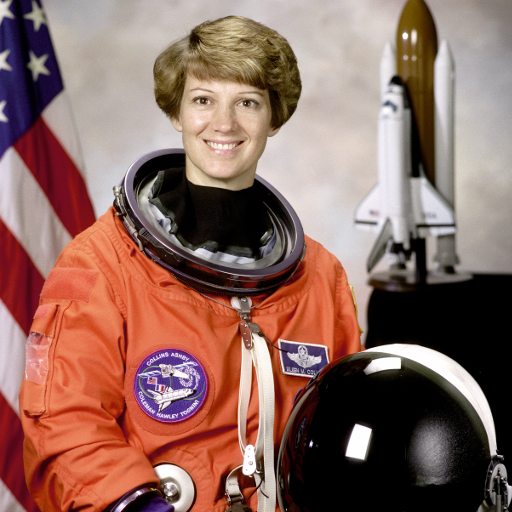
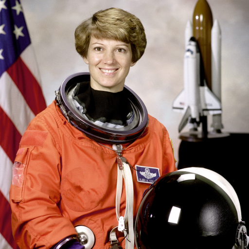
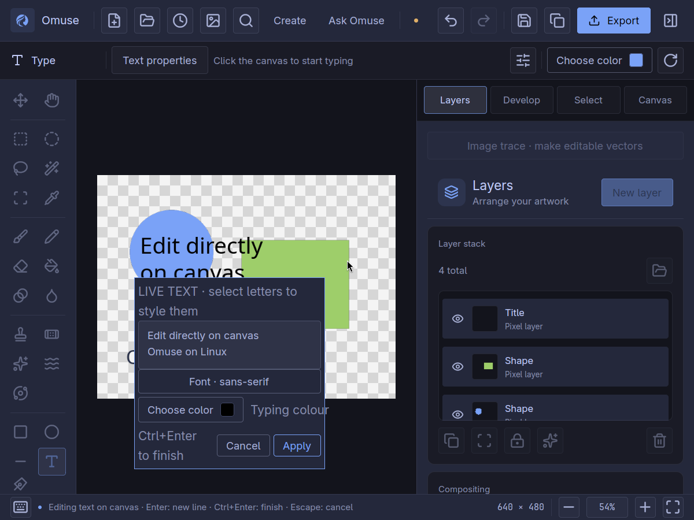

# Retouch detail and control the canvas

[User manual](README.md) · [Photo editing](photo-editing.md) · [Text and layout](create-content.md)

These workflows describe **Omuse 0.9.0**: source-resolution
retouch, controlled removal, grid alignment, mask inspection and live fonts.
See [release notes](../releases/v0.9.0.md) and
[qualification and limits](../release-090-qualification.md).

## Remove an object using surrounding texture

**Controlled content-aware removal** rebuilds a selected area by building a
replacement inward from the unselected boundary. It compares nearby texture
with the surrounding image and the detail already reconstructed. This is a
local pixel operation: it does not require an AI connection.

1. Preserve the original project and duplicate the photo layer. Select the
   unwanted object, leaving some clean surrounding image unselected.
2. Use **Ctrl+K → Controlled content-aware removal**, or open it from the
   **Selection** inspector.
3. Set **Sampling rectangle X**, **Y**, **Sampling width** and **Sampling
   height** to a clean area in source-image pixels. Keep suitable texture near
   the target inside this rectangle; target pixels are excluded automatically.
4. Begin with **Search radius 32**, **Patch radius 2** and **Feather 0**.
   Search radius accepts **1–64 pixels** and patch radius **0–4**. The new
   algorithm always needs surrounding context, even with patch radius set to 0.
5. Review the preview for seams and repeated texture; refine the target
   selection and feathering when an edge needs a softer transition. If Omuse reports no
   suitable source, enlarge or move the sampling rectangle, increase search
   radius within its limit, or reduce patch radius. Selecting the entire image
   leaves no surrounding context and is refused.
6. Choose **Apply** to create a new **Removal · editable** result with its
   source and recipe retained. **Ctrl+Z** restores the previous document.

Controlled removal accepts sources up to **4,000,000 pixels**, with additional
work limits. It refuses missing donor context without committing a partial
edit. Suitable nearby texture is still necessary: a larger radius cannot
invent a missing face, text or complex geometry. Try Clone for precise edges
or a capable AI route for a reviewed generative reconstruction. Inspect every
repair; some texture mismatch remains in the reviewed portrait. Automatic Spot Healing
is a separate method: a portrait fixture repeated nearby lettering and zipper
detail, so a completed operation is not proof of a natural-looking repair.

| Original | Controlled removal |
| --- | --- |
|  |  |

*Actual engine output from the reviewed portrait. The clean sampling rectangle
excludes the name badge and zipper. A mild seam and texture mismatch remain;
this example demonstrates the repair and its limits. NASA / Eileen Collins,
public domain. [Settings, source and credits](../releases/images/v0.9.0/README.md).*

### Keep new removal recipes safe when trying an older version

New controlled-removal recipes record **ContextualV1**. Recipes saved without
an algorithm keep the **Legacy** behavior; opening them does not silently
change their result. The existing `.omuse` container formats remain in use,
but that alone does not guarantee an older editor preserves a new recipe.

Omuse 0.8 can display the saved, cached result. **Editing or resaving a new
recipe in 0.8 can discard its algorithm choice**, so a later evaluation may
use the older behavior. Preserve the 0.9 original. For backward editing, save
a separate copy and, in 0.9, duplicate the removal result and use
**Ctrl+K → Rasterize object** on the copy before opening it in 0.8. Use the
rasterized result there and keep the editable original for returning to 0.9.
Rasterizing deliberately gives up that copy's editable removal recipe.

## Align artwork with a configurable grid

1. Open **Canvas → View & alignment** in the right inspector. Turn on
   **Pixel grid** and **Snapping**. **Ctrl+'** toggles the grid; command search
   (**Ctrl+K**) also finds **Toggle grid** and **Toggle snapping**.
2. Click **Grid spacing** to cycle the major spacing through **4, 8, 16 and
   32 canvas pixels**. Click **Grid subdivisions** to cycle **1, 2, 4 or 8**
   subdivisions. These are preset buttons, not free-form numeric fields.
3. For example, **16 px** spacing with **4** subdivisions puts minor lines
   **4 px** apart. Snapping uses the minor lines. Enable **Guides** when you
   also want nearby guides to attract the pointer.
4. Drag with **Move**, or draw a rectangular/elliptical selection, rectangle,
   ellipse, line or gradient. Snapping acts when the relevant pointer is near
   a configured grid line or visible guide; it does not change brush strokes or
   automatically realign existing artwork. The grid must be visible for grid
   snapping to act.
5. Hold **Shift** to temporarily bypass **grid** snapping. Visible guides can
   still snap, and Shift keeps its other tool behaviour, such as selection
   combination or transform constraints. Turn **Snapping** off for an entirely
   unsnapped placement.

Grid spacing, subdivisions and visibility are remembered as workspace
preferences. Dense grids simplify their drawing as you zoom out; snapping
retains the configured minor spacing. They do not add an Undo step or appear
in exported artwork.
**Change grid spacing** and **Change grid subdivisions** are also searchable
commands without default keys; assign your own with **Ctrl+Alt+K**.

## Inspect a mask before refining it

1. In **Layers**, locate a layer with a **MASK** badge. If it has no mask,
   create one first using the existing [cutout workflow](photo-editing.md#cut-out-a-subject-or-change-the-background).
2. **Alt-click the MASK badge** to inspect that mask in grayscale. White
   represents revealed coverage, black hidden coverage and gray partial
   coverage. The badge highlights the inspected mask.
3. Inspect edges and holes at **100%** with **Ctrl+1**, or fit the canvas with
   **Ctrl+0**. This is an inspection view: canvas painting is blocked while
   it is active.
4. **Alt-click the same badge again** to return to the artwork. Alternatively,
   select that layer and run **Inspect layer mask** through **Ctrl+K** to
   toggle the view. **Escape** also leaves inspection when the canvas has focus.
5. To change the mask, first leave inspection, then click its badge normally.
   Normal clicking selects the layer and enables mask painting. Paint white
   to reveal or black to hide, then inspect again.

Inspection does not alter the photo, save a new mask, or add a document Undo
step. Exports still contain the artwork, not this grayscale view. Mask
inspection and mask painting are separate modes; return to the artwork to
judge the mask's effect on the composite.

## Release an ordinary folder without flattening its children

1. Select one folder in **Layers**. Finish or cancel any floating pixel
   selection first.
2. Open **Layer actions → Ungroup folder**, or search **Ungroup folder** with
   **Ctrl+K**.
3. Its children replace the folder at the same position in the layer tree,
   retaining their order, placement and editable contents. They become the
   selection. **Ctrl+Z** restores the folder in one step.

The folder must be visible and unlocked, with unlocked parents and descendants,
**100% opacity**, **Normal** blending, no mask or effects, and no placement
transform. An empty folder or one carrying retained artwork cannot be
ungrouped. Child layers may keep their own effects, adjustments and blending.
Clipping relationships must keep the same result: the command refuses a folder
used as a live-mask source, a clipped folder, or an ungrouping that would change
a clipping stack across the folder boundary.

A refusal leaves the artwork intact and explains the reason. Keep a folder
whose settings contribute to the appearance; ungrouping does not bake those
settings into its children.

This command operates on one ordinary layer folder. It has no default key.
**Ctrl+Shift+G** remains **Ungroup vector selection** for vector objects; it is
not a shortcut for releasing a photo-layer folder.

## Preview a font on selected letters

1. Press **T** and click existing live text, or create a text box. Select the
   letters you want to restyle in the inline text field. Use **Ctrl+A** in that
   field when you intend to change the whole text.
2. Click **Font · …** below the field. Type part of an installed font name
   to filter the list. A selection containing different fonts is labeled
   **Mixed fonts**.
3. Hover a font, or use **Up/Down**, to preview it on the captured selection.
   Click a font or press **Enter** to keep that choice in the text draft and
   return focus to the selected letters.
4. To abandon the font preview, press **Escape**, click the font button again,
   or click outside the popup and text box. The previous formatting and text
   selection return; this does not cancel the entire text edit.
5. When the complete text is ready, choose **Apply** or press **Ctrl+Enter**.
   The complete edit becomes one document Undo step. After closing any font
   popup, **Cancel** or **Escape** abandons the text draft.

With only a caret and no selected letters, a chosen font applies to text you
type next. It does not restyle all existing letters. Moving the caret follows
the surrounding text style again. Choose the font explicitly before applying
the text: an unconfirmed hover is restored when the text draft finishes.

The list uses fonts installed on this computer and shows up to 64 matches at
a time; narrow the search if needed. Long lists keep readable rows as you scroll.
This control edits live text, not lettering
already baked into a photo or an unsupported imported Photoshop text layer.

*Actual 0.9 runtime `65c95cc1` on Omarchy/XWayland at 800 × 600 logical
pixels. The keyboard hint wraps and Apply/Cancel remain inside the text panel.
[Capture details](../releases/images/v0.9.0/README.md).*

## Control blur strength separately from brush size

Omuse 0.9 edits the source pixels directly when a photo layer is
scaled, rotated or flipped. Its placement and original pixel dimensions stay
the same. This avoids reducing the source to its displayed canvas size before
retouching; it does not add detail to a small photograph.

1. Duplicate the photo layer with **Ctrl+J**. Select a visible, unlocked pixel
   layer; its parent folders must also permit editing. Keep retained RAW,
   16-bit and other editable sources, and use **Ctrl+K → Rasterize object** on
   a duplicate when pixel painting is needed. This deliberately converts that
   duplicate to 8-bit pixels; keep the retained original for further development.
2. Use **Ctrl+K → Blur brush tool**. Adjust **Size px**, **Hardness %** and
   **Opacity %** in the options bar to choose the painted area and strength.
3. Set **Radius px** independently of brush size. Its range is **0.25–128
   canvas pixels**, starting at **2 px**. A larger brush covers more area;
   a larger radius spreads the blur farther around each affected pixel.
4. Paint short strokes and release to apply. Inspect the result with **Ctrl+1**
   for 100% canvas zoom; zoom farther in when a large source is scaled down on
   the canvas. **Ctrl+Z** reverses a completed stroke. Changing the radius
   setting alone does not alter the image.

Use **Ctrl+K → Smudge tool** to pull colour along a drag, or **Liquify tool**
(**Ctrl+Shift+X**) to push and reshape existing detail. Smudge carries the
evolving colour; Liquify calculates the stroke's displacement before sampling
the original pixels. Start with a small brush and low opacity for delicate
changes. These are direct raster edits, not an editable filter recipe.

A pixel selection limits where results are written, including its soft edge.
Neighbouring colour outside the selection can still supply the blur, smudge or
warp; a selection is not an excluded sampling region. Blur preserves the
source alpha channel. Clone and Healing remain separate tools with their
existing [Alt-click sampling workflow](remove-objects.md#precise-repair-clone-or-healing).

For mask retouch, select the **MASK** badge normally after leaving inspection,
then use Blur, Smudge or Liquify. These retouch operations retain the existing
mask bitmap extent. To extend mask coverage, use ordinary
[mask painting or a gradient](photo-editing.md#extend-a-painted-mask).

The native path bounds work to source or mask surfaces up to **16 MP**, a
limited stroke length and a **256 MiB working-buffer budget**. Sheared or
invalid transforms are refused. A very large brush, blur radius, transformed
footprint or long drag can also be refused. These bounds are not a guarantee
that every operation fits on every machine.

| If the stroke cannot be applied | Next step |
| --- | --- |
| Source or mask exceeds 16 MP | Work on a separately saved, downsampled copy. Scaling a layer on the canvas does not reduce its source pixel count. |
| Brush, radius, stroke or working memory exceeds a limit | Try a smaller brush or Blur radius, or split the work into shorter strokes. A rejected stroke leaves the artwork unchanged. |
| Retouch makes no change | Check the active pixel layer or mask, layer and parent locks/visibility, selection coverage and opacity. Smudge and Liquify need a drag, not a single click. |

A repeated mouse-up position does not consume another stroke point. If the
recorded path genuinely exceeds its limit, Omuse cancels that stroke and shows
a reason instead of applying only part of it.

The desktop currently computes these strokes on release. **Escape does not
interrupt that calculation**; wait for it to finish, then use Undo if needed.
The engine has cancellation support, but an interactive cancel control remains
separate work.
